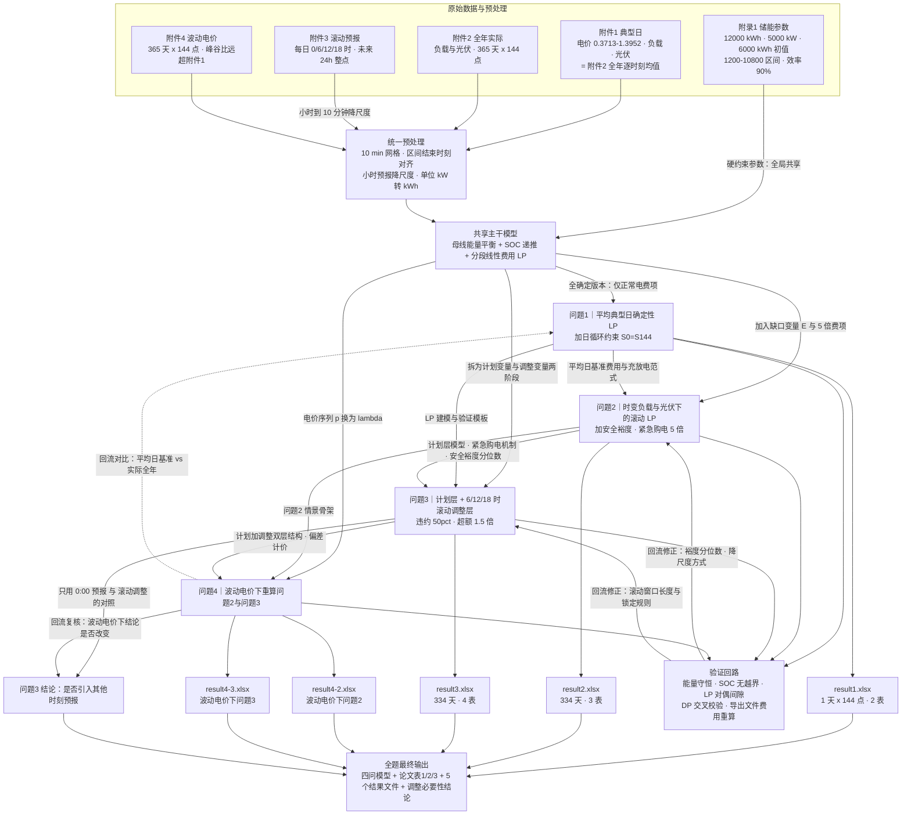

# C 题《微网与外部电网电力调控策略》·全文建模主线与分问模型选型

> 技能：`bzd-modeling-ideas`（生成类）
> 已读参考：`integrated-modeling-patterns.md`、`cumcm-abcde-modeling-patterns.md`、`strategy-output-standard.md`
> 前置输入：`bzd-problem-translator` 的 51 条逐句台账（`C题-微网与外部电网电力调控策略-题意逐句翻译.md`）
> 数据支撑：本次实测探查结果（`_work/data_probe_report.md`）
> 定位：**解题思路阶段，不含求解结果**。所有数值结论均为数据探查的实测统计量，非求解输出。

---

## 1. 整题建模主线

### 1.1 研究对象与中心矛盾

研究对象是一个**并网（非孤岛）微网**：内部有光伏发电、储能设备、小区负载三要素，外部通过唯一通道——外网购电——实现能量平衡。决策变量是**每 10 分钟时段的购电量与储能充放电量**。

中心矛盾可以一句话概括：

> **在满足"供电量 ≥ 负载"硬约束的前提下，让购电总费用最小；但费用被三个不确定源（负载、光伏出力、电价）和三个制度性摩擦（紧急购电 5 倍、少买违约 50%、多买 1.5 倍）共同支配。**

四问的递进，本质是**逐层打开不确定源与摩擦项**：

| 问题 | 打开的维度 | 新引入的费项 | 决策结构 |
|---|---|---|---|
| 问题1 | 全确定（电价、负载、光伏均已知且逐日不变） | 仅正常购电费 $p_t G_t$ | 单日一次优化 + 日循环 |
| 问题2 | 负载与光伏时变、与计划存在偏差 | + 紧急购电 $5p_t E_t$ | 逐日滚动 + 跨日 SOC 递推 |
| 问题3 | 新增日内滚动预报（信息随时间刷新） | + 违约 $0.5p_t$ / 超额 $1.5p_t$ | 计划层 + 调整层（两阶段/滚动） |
| 问题4 | 电价本身也波动 | 同上，但 $p_t \to \lambda_{d,t}$ | 在波动电价下重算 2、3 |

### 1.2 推荐的主干骨架：10 分钟粒度的"能量平衡 + SOC 递推 + 分段线性费用"线性规划

四问共用同一套骨架，只是**目标函数项**与**信息集**不同：

$$
\begin{aligned}
\min \quad & \text{Cost} = \underbrace{\sum_{t} p_t\,G^{\text{实际结算量}}_{t}}_{\text{正常电费}}
+ \underbrace{\sum_t 5p_t E_t}_{\text{紧急购电}}
+ \underbrace{\sum_t \big[0.5p_t(G^p_t-G^a_t)^+ + 1.5p_t(G^a_t-G^p_t)^+\big]}_{\text{调整相关}} \\[4pt]
\text{s.t.}\quad
& G_t + P_{t}\Delta t + \eta_d H_t - \frac{C_t}{\eta_c} + E_t = L_t\Delta t, \quad E_t \ge 0 \quad \text{(母线能量平衡)}\\
& S_t = S_{t-1} + C_t - H_t \quad \text{(储电量递推)}\\
& 1200 \le S_t \le 10800,\quad S_t \le 12000 \quad \text{(安全区间与容量)}\\
& 0 \le C_t,\, H_t \le 833.33 \quad \text{(功率上限 5000 kW × 1/6 h)}\\
& S^{(d)}_{0} = S^{(d-1)}_{144} \quad \text{(跨日状态传递)}
\end{aligned}
$$

**为什么这条骨架能贯穿全文：**

1. **它精确对应题面给出的每一个机制**——"低储高放"、"光伏本地消纳"、"不可低于负载"、"储能电量必须保持在 1200–10800"全部落在约束里，没有一项被丢弃或软化。
2. **它是线性的，且目标是凸的分段线性函数**，因此四问都可以用**线性规划（LP）精确求解**，不需要启发式也能拿到全局最优。这一点至关重要：第 3 节的推导会说明
   $$f(G^p, G^a) = \min(G^p,G^a) + 0.5(G^p-G^a)^+ + 1.5(G^a-G^p)^+ = \max\{0.5G^p+0.5G^a,\; 1.5G^a-0.5G^p\}$$
   是两个线性函数的最大值，故为**凸**的分段线性函数，可直接线性化。
3. **它的状态变量（储电量）天然承担跨问接口**——问题1 的 $S_0=S_{144}$ 是它的特例；问题2–4 的跨日递推是它的自然展开；问题4 换电价序列不影响任何结构。
4. **规模可承受**：单日 144 时段、变量约 $4\times144\approx576$ 个，334 天逐日滚动求解完全在秒级到分钟级。

### 1.3 数据探查给出的三个"必须先知道"的事实

这三条来自实测，直接决定了后面的选型，不是推测：

| 事实 | 实测结果 | 对建模的强制影响 |
|---|---|---|
| **附件1 的"某天"就是全年平均日** | 附件1 负载曲线与附件2 全年逐时刻均值**逐点偏差 0.0 kW，相关系数 1.0000**；光伏同样如此（偏差 0.0，相关系数 1.0000） | 问题1 的"每天电价和负载相同"应理解为**每天都等于全年平均典型日**；附件1 的光伏预测 = 全年平均光伏曲线。问题1 因此是"平均日"上的确定性优化，其结果是全年其余问题的天然对照基准 |
| **充电的两个触发窗口在时间上错开** | 净负载最低小时 = **10、11、12、13** 时（谷值 −1950 kW，光伏倒送）；电价最低小时 = **0、1、22、23** 时（约 0.42 元/kWh）；电价最高 = 18、19、20 时（1.27–1.35 元/kWh） | 题干"电价较低**或**分布式能源有剩余电量"是**两个并列且时间错开的充电窗口**，不是同一件事。任何只做"低价充电"的启发式都会漏掉 10–13 时的零成本余电 |
| **储能在全天能量尺度上很小，但在功率尺度上关键** | 日净负载均值 **55 542 kWh** ≫ 储能可用容量 $10800-1200=9600$ kWh（仅约 17%）；但净负载 > 5000 kW（超过放电功率上限）的时段占 **6.58%** | 储能**不能跨日搬运大量电量**，只能做日内峰谷搬移 → 多日问题应建模为"日内优化 + 跨日 SOC 递推"，而非跨日大循环。同时，高峰时段购电是主力，紧急购电主要来自**预测偏差**而非容量不足 |

**由此得到本题最核心的一条判据**（见 6.2 的完整推导）：由于缺口电价 5 倍、正常电价 1 倍，**最优计划应主动带上安全裕度，其大小恰为光伏预测误差分布的 80% 分位数**（报童模型临界比 $4p/(4p+p)=0.8$）。这条判据同时解释了问题2 的紧急购电从何而来、问题3 的调整为何值得。

---

## 2. 跨问题联动链

图中两条实线回流（`VER → Q2`、`VER → Q3`）表示验证结果反过来修正安全裕度分位数与滚动窗口设置；一条虚线回流（`Q4 ⇢ Q1`）表示用波动电价下的全年结果复核"平均典型日"基准的代表性。

---

## 3. 全文统一建模口径

### 3.1 时间、索引与单位

| 符号/项 | 定义 | 取值/单位 | 口径约定 | 使用问题 |
|---|---|---|---|---|
| $d$ | 日期索引 | 2025-01-01 … 2025-12-31（365 天） | 结果交付只报 2.1–12.31（334 天） | 2、3、4 |
| $t$ | 日内时段索引 | $1,\dots,144$ | 10 分钟一点 | 全题 |
| $\Delta t$ | 时段长度 | $1/6$ h | 功率 kW × 1/6 = 电量 kWh | 全题 |
| 时间标签 | 附件列为**区间结束时刻** | 00:10 … 24:00（`0:00+1`） | 第 $t$ 点覆盖 $[t-10\text{min},\,t)$；结果模板的"起—止"标签按行一一对齐后会错一格，**必须在论文中声明对齐方式** | 全题 |
| $L_{d,t}$ | 小区负载功率 | kW（附件2 实际值） | 能量需求 $=L_{d,t}\Delta t$ | 全题 |
| $P_{d,t}$ | 光伏实际功率 | kW（附件2） | 用于结算与缺口判定 | 2、3、4 |
| $\hat P^{(\tau)}_{d,t}$ | $\tau$ 时刻发布的光伏预报 | kW，$\tau\in\{0,6,12,18\}$ | 整点粒度，需降尺度到 10 min | 3、4 |
| $p_t$ | 附件1 分时电价 | 元/kWh，0.3713–1.3952 | 逐日不变 | 1、2、3 |
| $\lambda_{d,t}$ | 附件4 实时电价 | 元/kWh，0.0076–1.7936 | 逐日且逐时波动 | 4 |

### 3.2 决策变量

| 符号 | 定义 | 单位 | 说明 | 使用问题 |
|---|---|---|---|---|
| $G^p_{d,t}$ | 计划购电量（0:00 一次确定） | kWh | 正常电费的结算基数 | 全题 |
| $G^a_{d,t}$ | 调整后购电量（6/12/18 时修订） | kWh | **取"调整后的量"而非"调整增量"**（需在论文声明） | 3、4 |
| $E_{d,t}$ | 紧急购电量 | kWh | 被动补足缺口，$E\ge 0$ | 2、3、4 |
| $C_{d,t}$ | 充电量 | kWh | **池内口径**：进入电池的电量，从母线取 $C/\eta_c$ | 全题 |
| $H_{d,t}$ | 放电量 | kWh | **池内口径**：离开电池的电量，注入母线 $\eta_d H$ | 全题 |
| $S_{d,t}$ | 储电量（状态变量） | kWh | $S_t=S_{t-1}+C_t-H_t$ | 全题 |

> **效率口径（决策点 D3）**："充放电效率 90%"存在歧义。本报告统一采用**池内口径 + 充放各 90%**（往返约 81%），理由是它使 SOC 递推不含系数、最易验证；另一种"往返 90%"作为敏感性分析。两种口径下的最优策略差异必须量化对比。

### 3.3 参数与约束

| 项 | 数值 | 约束形式 | 使用问题 |
|---|---|---|---|
| 最大容量 | 12000 kWh | $S_t \le 12000$（被安全上限支配） | 全题 |
| 安全区间 | 1200–10800 kWh | $1200 \le S_t \le 10800$（硬约束） | 全题 |
| 最大充放电功率 | 5000 kW | $C_t, H_t \le 5000/6 = 833.33$ kWh/时段 | 全题 |
| 初始电量 | 2025-01-01 00:00 = 6000 kWh | $S^{(1)}_{0}=6000$ | 2、3、4 |
| 效率 $\eta_c,\eta_d$ | 0.90 | 见母线平衡式 | 全题 |
| 母线能量平衡 | — | $G_t + P_t\Delta t + \eta_d H_t - C_t/\eta_c + E_t = L_t\Delta t$ | 全题 |
| 日循环 | 问题1 专属 | $S_0 = S_{144}$ | 1 |
| 跨日递推 | — | $S^{(d)}_{0}=S^{(d-1)}_{144}$ | 2、3、4 |

> 同时充放电（$C_t H_t > 0$）无需显式禁止：因 $\eta<1$，同时充放纯损耗，最优解会自动排除。论文中给出这一简短证明即可。

### 3.4 费用口径（决策点 D2）

题面"超出部分的**电价**是 1.5 倍""违约**电价**是 50%"——"电价"二字表明这是对**该部分电量**的结算单价，而非在原价之外叠加。故推荐：

$$
\text{Cost} = \sum_t p_t\min(G^p_t,G^a_t) \;+\; \sum_t 0.5p_t(G^p_t-G^a_t)^+ \;+\; \sum_t 1.5p_t(G^a_t-G^p)^+ \;+\; \sum_t 5p_t E_t
$$

即问题3 的单时段费用等价于

$$
f(G^p,G^a)=\min(G^p,G^a)+0.5(G^p-G^a)^+ + 1.5(G^a-G^p)^+
= \max\{0.5G^p+0.5G^a,\; 1.5G^a-0.5G^p\}
$$

**两个线性函数的最大值 → 凸的分段线性 → 可直接线性化为 LP**。

> 备选口径：把"计划购电费用"严格理解为 $\sum p_t G^p_t$ 全额照付，再叠加违约/超额。此口径下多买部分实际支付 $1.0+1.5=2.5$ 倍，经济含义可疑。**建议作为敏感性分析列出，不作为主口径**，并在论文中说明选择理由。

### 3.5 关键派生量

| 量 | 定义 | 实测/用途 |
|---|---|---|
| 净负载 $N_{d,t}$ | $L_{d,t}-P_{d,t}$ | 全年 min −6602 / max 6688 kW；>5000 kW 占 6.58% |
| 日净负载电量 | $\sum_t N_{d,t}\Delta t$ | 均值 55 542 kWh；与储能可用 9600 kWh 对比，证明只能日内搬移 |
| 预报误差 $e$ | $\hat P - P$ | 全样本 MAE 447 kW、RMSE 727 kW、Bias −32 kW（归一化 RMSE 31.4%） |

---

## 4. 分问题求解思路

---

### 4.1 问题1：平均典型日下的单日计划购电

#### 4.1.1 问题概述

- **任务**：在电价与负载逐日不变、已知一天光伏预测的条件下，于每天 0:00 制定全天计划购电策略的数学模型，并给出具体策略。
- **已知（题面给定）**：附件1 的分时电价、负载、光伏预测（10 min×144）；附录1 的储能参数。**实测补充**：附件1 的负载与光伏曲线 = 附件2 全年逐时刻均值（偏差 0.0），故"每天相同"即"每天等于全年平均日"。
- **新引入的假设**（非题面）：① 光伏预测在该日准确；② 充放效率各 90%；③ 同一时段不买卖双向（目标自动保证）。
- **输出**：论文表1（6 个 10 min 时段购电量 + 全天购电量 + 全天购电费）、表2（6 个 4 h 块充放电量 + 0:00/24:00 储电量）、`result1.xlsx`（2 表）。
- **本质**：**带终端等式约束的单日确定性凸优化（LP）**。之所以是 LP，是因为目标 $\sum p_t G_t$ 线性、全部约束线性，唯一"特殊"之处是 $S_0=S_{144}$ 这一**耦合首尾的等式约束**——它使问题不能按时段贪心分解，必须整体求解。

#### 4.1.2 总体求解思路

1. 读入附件1，按"区间结束时刻"对齐 144 点，功率乘 $1/6$ 转电量。
2. 建立单日 LP：变量 $G_t, C_t, H_t, S_t$（$t=1..144$），约束为母线平衡（$E_t\equiv 0$，因无缺口机制）、SOC 递推、安全区间、功率上限、$S_0=S_{144}$。
3. 用 LP 求解器（HiGHS / CBC / Gurobi）求全局最优。
4. 验证：能量守恒逐点校验、SOC 无越界、$S_0$ 与 $S_{144}$ 数值一致、对偶间隙为零、与 DP 结果对照。
5. 汇总输出表1（10 min 粒度）、表2（4 h 块汇总）、`result1.xlsx`。
6. **向下游传递**：该 LP 的建模与验证模板、单位换算口径、"平均日基准费用"数值——三者被问题2/3/4 直接复用作为对照基线。

#### 4.1.3 可用模型及选型比较

| 可行模型/思路 | 模型本质与核心变量 | 完整实现步骤 | 所需数据与假设 | 优点 | 局限与失败风险 | 验证方法 | 与前后问题的接口 | 适用场景 |
|---|---|---|---|---|---|---|---|---|
| **M1-1 单日确定性 LP（推荐）** | 线性规划；变量 $G,C,H,S$ 各 144；目标 $\min\sum p_tG_t$；凸分段线性目标 + 线性约束 | ① 数据转 kWh；② 写母线平衡/SOC/安全区间/功率上限/$S_0=S_{144}$；③ LP 求解；④ 对偶间隙与守恒校验 | 附件1 + 附录1；假设光伏预测准确、效率各 90% | 全局最优、可复现、求解秒级、约束表达与题面一一对应、可直接扩展为问题2–4 | 无法表达非线性效率/老化；日循环等式使问题不能分解 | 对偶间隙=0；能量守恒逐点残差<1e-6；SOC 越界检查；与 DP 结果逐点对照 | 输出的建模模板、单位口径、基准费用进入问题2/3/4 | 主力模型 |
| **M1-2 动态规划（SOC 离散化）** | 马尔可夫决策过程；状态 $(t, S_t)$，$S$ 离散为若干档（如 100 kWh 一格 → 97 档）；决策 $(C,H,G)$ | ① SOC 网格化；② 逆向递推求最优值函数；③ 前向回溯得最优策略 | 同 M1-1；需额外决定网格分辨率 | 直观展示"何时充、何时放"的决策结构；可处理非凸/非线性费用；天然给出策略图 | 网格离散化误差；状态×决策组合约 144×97×档，维度略高；精度受分辨率支配 | 网格加密收敛性检验（100→50→25 kWh）；与 LP 最优值比较，差距应<0.1% | 作为 LP 的**独立交叉验证**；其"充放电时机"图可直接进论文 | 验证与可视化对照 |
| **M1-3 峰谷时段聚合/两档启发式** | 规则型基线；把 144 点按电价分档（实测：低价 0/1/22/23 时，高价 18/19/20 时，余电窗 10–13 时） | ① 按电价排序分档；② 低价档与光伏倒送档充电、高价档放电；③ 校验 SOC 与功率约束 | 同 M1-1；假设"低价=宜充、高价=宜放" | 计算极快、物理含义清晰、可作为下界/可解释基线 | 忽略 SOC 轨迹可行性与效率损失，可能不可行；忽略"低价窗与余电窗错开"的事实 | 与 LP 最优费用比较，报告百分比差距；检查其方案是否满足全部硬约束 | 提供"朴素策略 vs 最优策略"的对照，体现优化价值 | 基线对照（不单独交付） |
| **M1-4 混合整数线性规划（MILP）** | 在 LP 基础上引入充/放互斥的 0-1 变量 $u_t$ | ① 加 $C_t\le M u_t$、$H_t\le M(1-u_t)$；② MILP 求解 | 同 M1-1 | 可严格禁止同时充放，可接入启停成本等离散因素 | 题面无启停成本，MILP 只会增加求解时间；已证 LP 最优解不会同时充放 | 与 LP 结果对照应完全一致（证实互斥约束非绑定） | 仅在后续需要离散决策时才启用 | 备选，非必需 |

- **推荐模型**：**M1-1（单日确定性 LP）**，以 **M1-2（DP）** 作为独立交叉验证，**M1-3** 作为可解释基线对照。
- **选用理由**：① 任务要求"数学模型"且要给出确定数值，LP 给出全局最优与对偶价格，最具说服力；② LP 骨架可被问题2/3/4 原样继承，只增删目标项与变量，保证全文口径统一；③ 实测数据显示日净负载 55 542 kWh 远大于储能可用 9600 kWh，策略本质是"日内搬移"，LP 能精确刻画这一结构；④ DP 与 LP 两条独立路线互验，满足"独立验证"要求。
- **备选模型**：只有当后续需要引入离散决策（如储能启停成本、分段效率曲线）时，才切换到 **M1-4**；若发现 LP 结果与 DP 在加密网格后仍不一致，则以 DP 为准排查 LP 建模错误。
- **多模型对比建议**：三种路线在**完全相同的数据、约束、目标**下比较，统一指标为"全天购电费（元）"；额外报告 SOC 轨迹的最大越界量与求解耗时；DP 需报告网格加密下的收敛率。

#### 4.1.4 创新与改进方向

| 创新或改进方向 | 基础方案 | 具体改动与实现步骤 | 预期改进 | 新增工作量 | 验证指标与对照实验 | 风险及备用方案 | 影响的问题 |
|---|---|---|---|---|---|---|---|
| **双窗口充电机制的显式刻画** | 仅按电价阈值充电 | 把充电触发拆成"低价窗"（实测 0/1/22/23 时）与"光伏倒送窗"（实测 10–13 时，净负载 −1950 kW）两类，分别建模并在结果中标注两类充电量占比 | 避免漏掉零成本余电；实测倒送时段占 19.27%，遗漏会显著抬高费用 | 小（结果后处理 + 分账统计） | 对照"仅低价充电"策略，报告费用差与弃光电量 | 若倒送被题面禁止（无倒送条款），则改为"余电优先充电"表述 | 1、2、3、4 |
| **对偶价格（影子价格）分析** | 只给最优策略 | 输出每个时段的电量影子价格与功率约束影子价格，识别真正的瓶颈时段 | 把"为什么这样充放"从定性变定量，可直接解释 18–20 时为何放电 | 小（LP 求解器直接给出） | 影子价格与电价排序的一致性检验 | 求解器不支持则省略 | 1、2、3、4 |
| **附件1=全年平均日的实证确认** | 直接把附件1 当"某天" | 计算附件1 与附件2 逐时刻均值的偏差与相关系数（实测 0.0 kW / 1.0000），在论文中给出 | 把"每天相同"这一模糊表述坐实为"等于平均典型日"，消除口径争议 | 小 | 偏差与相关系数数值 | 无 | 1（并为 2/3/4 提供基准） |

---

### 4.2 问题2：时变负载与光伏下的计划购电与紧急购电

#### 4.2.1 问题概述

- **任务**：电价逐日不变（附件1），负载与光伏随时间变化（附件2），每天 0:00 制定当天计划购电策略；若实际供电低于负载则紧急购电（5 倍电价）；其他时段费用按计划购电量计。
- **已知（题面给定）**：附件1 电价、附件2 全年实际负载与光伏、附录1 储能参数、初始电量 6000 kWh。
- **新引入的假设**：**这是本题最大的建模决策点（D1）**。见下。
- **输出**：论文表1/表2（表3 四个指定日期：3.20、6.21、9.23、12.21）+ 表3（紧急购电）+ `result2.xlsx`（3 表，2025.2.1–12.31）。
- **本质**：**带跨日状态递推的多日随机/确定性优化**，核心是"计划量"与"实际需求"两个不同信息集之间的偏差如何被 5 倍电价惩罚。

> **决策点 D1（必须显式声明，见 8.2）**：题面说"根据附件1中的电价和附件2中的数据，在每天 0:00 制定当天的计划购电策略"，字面上暗示**制定计划时已知附件2 的当天实际负载与光伏**。若真如此，则计划与实现无偏差，**紧急购电恒为 0**，表3 全空——这与题面专门设计"紧急购电量"工作表并要求填报相矛盾。三种可选信息集及其后果见下表。

| 信息集方案 | 0:00 制定计划所用数据 | 紧急购电是否发生 | 与题面的关系 | 评价 |
|---|---|---|---|---|
| A 完美预知 | 附件2 当天实际值 | **恒为 0**（表3 全空） | 最贴合"根据附件2 制定"的字面 | 机制失效，交付物空洞 |
| B 日前预测驱动 | 附件3 的 **0:00** 次预报（降尺度），结算用附件2 | **真实发生** | "附件2 中的数据"解读为结算用实际值 | **推荐**：与问题3 完全同构，机制被激活 |
| C 典型日驱动 | 附件1 的负载与光伏（= 全年平均日） | 真实发生 | 利用"附件1=平均日"这一实测事实 | 可作为 B 的对照，解释力弱于 B |

本报告**推荐 B 为主、A 为对照**：主结果用 B 产生有内容的紧急购电表；同时在论文中用 A 证明"若预测完美则紧急购电为 0"这一**下界结论**，两者共同构成完整的因果链。

#### 4.2.2 总体求解思路

1. 数据准备：附件2 的 $L_{d,t},P_{d,t}$；附件3 的 0:00 次预报降尺度到 10 min 作为日前预测 $\hat P^{(0)}_{d,t}$。
2. **计划层**：以 $\hat P^{(0)}_{d,t}$ 和 $L_{d,t}$ 为输入，对每一天解一个带**安全裕度**的日前 LP，得到 $G^p_{d,t}$ 与计划充放电。
   - 关键：由于缺口电价 5 倍而正常电价 1 倍，最优计划**不应**直接用预测值，而应主动多买一个安全裕度（见 6.2 的 80% 分位数判据）。
3. **结算层**：用附件2 实际 $P_{d,t}$ 重算母线平衡，得到紧急购电 $E_{d,t}=\big(L_{d,t}\Delta t - \hat G_t - P_{d,t}\Delta t - \eta_d H_t + C_t/\eta_c\big)^+$。
   - 注意：题面明确"除紧急购电费用外，其他时间段的购电费用均按计划购电量计算"——**正常电费锁定在 $G^p$ 上，不得用实际量重算**。
4. 跨日递推：$S^{(d)}_0 = S^{(d-1)}_{144}$，从 2025-01-01 00:00 的 6000 kWh 起步；**1 月作为预热期**，结果从 2.1 开始报送（须在论文说明）。
5. 输出四个指定日期的表1/表2/表3 与 `result2.xlsx`。
6. **向下游传递**：计划层模型、紧急购电机制、安全裕度分位数——被问题3 直接继承；问题2 情景骨架被问题4 继承。

#### 4.2.3 可用模型及选型比较

| 可行模型/思路 | 模型本质与核心变量 | 完整实现步骤 | 所需数据与假设 | 优点 | 局限与失败风险 | 验证方法 | 与前后问题的接口 | 适用场景 |
|---|---|---|---|---|---|---|---|---|
| **M2-1 逐日滚动确定性 LP + 跨日递推（基准）** | 线性规划；逐日独立求解，$S$ 跨日传递；变量同 M1-1 加 $E_t$ | ① 每日用预测值解 LP；② 用实际值重算缺口得 $E$；③ 更新 $S$ 进入次日 | 附件1/2/3(0:00次) + 附录1；假设负载已知 | 结构最简、可直接继承问题1 模板、求解快 | 用点预测、无安全裕度 → 缺口频发、费用偏高；不解释"为什么紧急购电会发生" | 与 M2-2/M2-3 费用对照；能量守恒；SOC 越界检查 | 其"预测即决策"的缺陷正是 M2-2/M2-3 的动机 | 下界对照 |
| **M2-2 带安全裕度的机会约束/报童 LP（推荐）** | 在 M2-1 基础上，把光伏预测误差的分布显式引入：计划购电量 = 预测需求 + 裕度 $m$；$m$ 由欠买/超买成本比解析给出 | ① 用附件3 预报与附件2 实际的**历史同期**残差估计误差分布；② 按临界比 $4p/(4p+p)=0.8$ 取分位数作裕度；③ 把 $m$ 加入日前 LP 的等效负载；④ 滚动求解 | 需"历史残差可代表未来误差"的假设（滚动/分组验证） | **由题面的 5 倍电价解析推出最优裕度**，可解释性强；直接降低 5 倍惩罚的暴露；结论可迁移到问题3 | 误差分布非平稳（季节性强，实测 12.21 光伏覆盖率仅 28.4% vs 6.21 的 76.2%）→ 需分季节/滚动估计 | 滚动起点验证（用前 N 天估分布、后 M 天检验）；与实际最优裕度（网格搜索）对照；报告实际缺口率是否接近 20% | 裕度分位数进入问题3 的计划层；费用结构进入问题4 | 主力模型 |
| **M2-3 两阶段随机规划（场景树）** | 随机规划；一阶段决策 $G^p$（0:00），二阶段补偿 $E$（实现后）；场景由光伏误差抽样生成 | ① 用历史残差拟合分布（如按小时×季节的经验分布）；② 抽样 $K$ 个场景（$K$=50–200）；③ 解大规模 LP：$\min \sum p G^p + \frac1K\sum_k 5p E^{(k)}$；④ 样本外检验 | 同 M2-2，且需场景数足够 | 理论上最严谨，直接对期望费用优化；可自然扩展到问题3 的多阶段 | 规模 144×$K$ 可能很大；场景生成质量决定成败；求解耗时高 | 样本内/外稳定性（换随机种子）；场景数收敛性（$K$=50/100/200 目标值变化<1%）；与 M2-2 结果对照 | 场景生成模块可复用于问题3/4 | 进阶/对照 |
| **M2-4 鲁棒优化（盒式/预算不确定集）** | min-max 优化；光伏出力落在不确定集 $\mathcal U$ 内，对最坏情形优化 | ① 由历史残差构造不确定集（如 $\lvert\tilde P - \hat P\rvert \le \Gamma_t$）；② 转化为鲁棒对等式（仍为 LP）；③ 调节预算参数 $\Gamma$ | 需给出不确定集的合理边界 | 无需分布假设；对极端日（如 12.21）稳健；可给出费用的最坏界 | 过于保守，平均费用可能明显高于 M2-2；$\Gamma$ 需调参 | 报告"最坏情形费用"与"平均费用"的权衡曲线；与 M2-2 的平均费用对比 | 作为极端日的稳健性补充 | 保守对照 |
| **M2-5 完美信息 LP（A 方案）** | 与 M2-1 同构，但预测值 = 实际值 | 同 M2-1，输入换成附件2 实际值 | 附件1/2 | 给出**费用下界**，量化"预测不确定性的代价" | 不产生紧急购电，无法单独满足交付要求 | 作为所有方案的费用下界基准 | 下界基准进入问题3/4 的对比 | 对照基准 |

- **推荐模型**：**M2-2（带安全裕度的机会约束/报童 LP）**为主，**M2-1**（无裕度）与 **M2-5**（完美信息）作为上下界夹逼，**M2-3** 作为严谨性升级的对照。
- **选用理由**：① 题面的"5 倍紧急电价"与"正常电费按计划量计"共同构成一个标准的**不对称成本结构**，报童模型的临界比判据（80% 分位数）是它的解析解，既严谨又可解释，是本题最有力的建模抓手；② M2-2 仍是 LP，计算可行；③ 它自然地把"紧急购电为什么会发生"讲清楚——不是容量不足（实测净负载超 5000 kW 仅占 6.58%），而是**预测偏差 + 无裕度**；④ 裕度分位数可直接作为问题3 计划层的输入。
- **备选模型**：若历史残差分布非平稳到分位数判据失效（用滚动验证判定），则改用 **M2-3**（场景树）或 **M2-4**（鲁棒）；若团队不接受信息集 B，则退回 **M2-5** 并明确写出"完美预测下紧急购电为 0"的结论。
- **多模型对比建议**：统一输入（同一套预测与结算数据）、统一约束（同一套储能参数）、统一指标（全年总费用、紧急购电次数与电量、平均缺口深度、SOC 越界次数、求解耗时）。所有随机类方案用**相同的滚动划分**估参与检验，禁止用全样本残差去预测全样本（泄漏）。

#### 4.2.4 创新与改进方向

| 创新或改进方向 | 基础方案 | 具体改动与实现步骤 | 预期改进 | 新增工作量 | 验证指标与对照实验 | 风险及备用方案 | 影响的问题 |
|---|---|---|---|---|---|---|---|
| **安全裕度的分位数解析解** | 用点预测直接决策（M2-1） | 由 5 倍/1 倍的不对称成本推出临界比 0.8，计划量 = 预测需求 + 误差分布 80% 分位数；分季节/分小时估计分布 | 把"拍脑袋留余量"变成可推导的最优决策；显著降低 5 倍惩罚暴露 | 中（需做误差分布估计 + 分季节） | 对照 M2-1，报告紧急购电费用下降幅度与实际缺口率（理论应≈20%） | 分布非平稳 → 改滚动估计或退回场景树 | 2、3、4 |
| **不确定性的代价分解** | 只报总费用 | 把费用拆为"完美信息下界（M2-5）+ 预测不确定性的代价（M2-2 − M2-5）+ 保守性代价（M2-4 − M2-2）"三项 | 清楚回答"钱花在哪、还能省多少"，评审可读性强 | 小（三方案费用相减） | 三项之和自洽；各项均为正 | 无 | 2、3、4 |
| **季节性自适应裕度** | 全区单一裕度 | 按月份/季节分别估计误差分位数（实测四季光伏覆盖率 28.4%–76.2%，差异极大） | 冬季光伏少、误差影响小，夏季反之；自适应可避免过保守 | 中 | 分季节报告紧急购电率与费用；与单一裕度对照 | 过拟合风险 → 用滚动验证 | 2、3、4 |
| **紧急购电时段的聚合上报** | 逐 10 min 记录缺口 | 按表4 规范把连续缺口时段聚合为"起—止区间 + 总电量"，起止对齐 10 min | 交付物更符合模板，且便于统计事件次数与持续时长 | 小 | 聚合前后总电量一致性校验 | 无 | 2、3、4 |

---

### 4.3 问题3：0:00 计划与日内滚动调整

#### 4.3.1 问题概述

- **任务**：每天 0:00、6:00、12:00、18:00 可获得未来 24 小时整点光伏预报；0:00 定计划，其他时刻可调整。计划高于调整的部分按 50% 付违约，调整高于计划的部分按 1.5 倍计价。总费用 = 计划购电费用 + 紧急购电费用 + 调整相关费用。要求**分析是否需要引入其他时刻的预报**。
- **已知**：附件1 电价、附件2 实际负载与光伏（结算用）、附件3 四次滚动预报（决策用）、附录1 参数、问题2 的计划层模型与紧急购电机制。
- **新引入的假设**：① "调整购电量"取"调整后的量"而非"调整增量"（须声明）；② 已执行时段不可回溯修改；③ 小时预报降尺度到 10 min 的方式（线性插值/阶梯保持）。
- **输出**：论文表1/表2/表3（四个指定日期）+ 调整必要性分析 + `result3.xlsx`（4 表）。
- **本质**：**两阶段（多阶段）随机决策 + 不对称偏差计价**，属于"确定性 → 不确定 → 滚动稳健"这一递进中的第二级；同时"是否需要调整"本身是一个需要对照实验回答的**决策问题**。

#### 4.3.2 总体求解思路

1. **降尺度**：把附件3 的整点预报映射到 10 min 网格（线性插值或阶梯保持），并估计降尺度引入的额外误差（作为不确定性的一部分）。
2. **计划层（0:00）**：用 $\hat P^{(0)}$ 与带裕度的日前 LP 求 $G^p_{d,t}$（继承问题2 的 M2-2 与裕度分位数）。
3. **调整层（6/12/18 时）**：在每个预报时刻 $\tau$，以 $\hat P^{(\tau)}$ 为最新预测，**固定已执行时段**（$t < \tau$ 的 $G^a$ 已锁定），对剩余时域重解 LP，得到新的 $G^a$。
4. **费用结算**：按 3.4 的分段线性费用式计算，其中紧急购电 $E$ 由附件2 实际值决定。
5. **对照实验（回答"是否需要"）**：
   - 对照组：只用 0:00 预报，全天一次优化，不调整（等价于问题2 的做法）；
   - 实验组：完整滚动调整；
   - 比较全年总费用、紧急购电量、偏差费用，并按季节/天气分组报告。
6. **判据分析**：给出解析判据——因为 $5p > 1.5p > 0.5p$，**只要预测误差会导致缺口（触发 5 倍），用 1.5 倍或 0.5 倍的代价去修正就总是划算的**；反之若误差方向是"多买"，调整反而更贵。因此调整的价值**主要来自避免低估光伏造成的缺口**。
7. **向下游传递**：计划—调整双层结构、偏差计价规则、降尺度方式被问题4 继承；调整必要性结论被问题4 复核。

#### 4.3.3 可用模型及选型比较

| 可行模型/思路 | 模型本质与核心变量 | 完整实现步骤 | 所需数据与假设 | 优点 | 局限与失败风险 | 验证方法 | 与前后问题的接口 | 适用场景 |
|---|---|---|---|---|---|---|---|---|
| **M3-1 滚动时域（MPC）确定性重优化（推荐）** | 滚动优化；每次用最新预报重解剩余时域 LP，已执行时段锁定；$G^p$ 与 $G^a$ 逐点比对计费 | ① 0:00 解全天得 $G^p$；② 6:00 固定 0:00–6:00，用 $\hat P^{(6)}$ 重解 6:00–次日 6:00；③ 12:00、18:00 同理；④ 拼接得全天 $G^a$；⑤ 按 3.4 计费 | 附件1/2/3 + 附录1；假设已执行不可改、降尺度方式明确 | 严格符合"0:00 定计划、其他时刻调整"的信息时序，**无未来信息泄漏**；实现直接；天然给出对照实验 | 每步用点预测，仍可能偏差；滚动窗口长度需设定 | 泄漏检查：确认 $\tau$ 时刻的解只用了 $\tau$ 及之前的预报；能量守恒；与免调整基线对照 | 继承问题2 的裕度分位数；结构被问题4 原样继承 | 主力模型 |
| **M3-2 免调整单阶段基线（对照组）** | 单阶段 LP；只用 $\hat P^{(0)}$，全天一次求解，不产生 $G^a$（即 $G^a=G^p$） | 同问题2 的 M2-2，直接沿用 | 同 M3-1 | 是回答"是否需要引入其他时刻预报"的**必需对照**；实现零成本 | 不是候选主模型，而是比较基准 | 与 M3-1 的差即为"滚动调整的净收益" | 提供对照基线；结论进入问题4 复核 | 必需对照 |
| **M3-3 多阶段随机规划（场景树）** | 随机规划；4 个阶段（0/6/12/18）对应 4 次预报，场景树刻画预报刷新过程 | ① 建立预报更新的误差过程模型（如误差随预见期衰减，实测 lead 1h RMSE 603 → lead 24h RMSE 986）；② 生成多阶段场景树；③ 解大规模 LP | 需预报**更新过程**的联合分布，数据要求高 | 理论最优，显式刻画"信息逐步揭示" | 规模爆炸（4 阶段 × 场景分支）；场景树构造主观；求解困难 | 与 M3-1 对照；场景数收敛性 | 可作为 M3-1 的理论上界对照 | 进阶/对照（非必需） |
| **M3-4 机会约束滚动（M3-1 + 裕度）** | 在 M3-1 的每一层滚动中嵌入问题2 的安全裕度分位数 | ① 每层用当前预报 + 对应预见期的误差分位数（lead 越短分位数越小）；② 重解剩余时域 | 需按**预见期**分层估计误差（实测已证明误差随 lead 增长） | 兼顾滚动与稳健；裕度随预见期自适应收缩，物理含义清晰 | 需维护"预见期—分位数"查找表 | 与 M3-1（无裕度）对照；报告缺口率 | 裕度机制与问题2 完全共享 | 推荐的增强版 |
| **M3-5 全知回溯（不应采用，仅作上界）** | 用附件2 实际光伏直接做计划与调整 | 直接代入实际值 | 附件2 | 给出费用绝对下界 | **信息泄漏**，违反"0:00 制定"的题设，不可作为交付方案 | 仅作为下界参考，且必须在论文中明确标注为"非合规上界" | 下界参考 | 仅对照 |

- **推荐模型**：**M3-4（机会约束滚动 MPC）**为主，**M3-2（免调整）**为必需对照，**M3-1** 用于隔离"裕度"与"滚动"各自的贡献（ ablation）。
- **选用理由**：① M3-1/M3-4 严格遵循信息时序，避免用未来预报回溯修改已执行决策——这是本题最大的隐藏陷阱；② 它对"是否需要调整"给出的是**可量化的对照实验**而非断言；③ 它能把 3.4 的凸分段线性费用直接嵌入每步 LP，计算可行；④ 裕度随预见期收缩，与实测的"误差随 lead 增长"完全一致（lead 1h RMSE 603 kW → lead 24h RMSE 986 kW）。
- **备选模型**：若 M3-4 的分位数表难以标定，退回 **M3-1**（点预测滚动）；若需要理论最优性论证，加做 **M3-3** 的小规模对照（如单日 4 阶段、场景数适中）。
- **多模型对比建议**：M3-1、M3-2、M3-4 在**同一套预报、同一套实际值、同一套费用公式**下比较；统一指标为全年总费用及其三项分解（计划/紧急/调整）、紧急购电事件次数、平均绝对偏差 $|G^a-G^p|$、求解耗时。**必须做消融**：滚动（有/无）× 裕度（有/无）四象限，才能说清各自的贡献。

#### 4.3.4 创新与改进方向

| 创新或改进方向 | 基础方案 | 具体改动与实现步骤 | 预期改进 | 新增工作量 | 验证指标与对照实验 | 风险及备用方案 | 影响的问题 |
|---|---|---|---|---|---|---|---|
| **预见期依赖的自适应裕度** | 全区/全预见期统一裕度 | 按"预见期 h → 误差分位数"建表（实测 h=1 的 RMSE 603 kW，h=24 的 986 kW），每次滚动用对应预见期的分位数 | 消除"远期过度保守、近期不够稳健"的问题 | 中（需按 lead 分层统计） | 分组报告各 lead 区间的缺口率是否接近目标值 | 分层样本不足 → 合并为 3 档（近/中/远） | 3、4 |
| **调整价值的解析判据** | 只做数值对照 | 由费用结构推出：缺口 5p、多买 1.5p、少买 0.5p，故"修正低估"的净收益为 $5p-1.5p=3.5p$（补买）或 $5p-0.5p$（若原计划偏高）；"修正高估"反而多付 $0.5p$。据此预测"调整收益主要来自避免缺口"，再用数据验证 | 把结论从"实验发现"提升为"机制解释" | 小（解析 + 分组统计验证） | 按误差方向分组统计：低估组的调整收益应显著大于高估组 | 若数据不支持，说明费用口径需重审（回到 D2） | 3、4 |
| **降尺度误差的显式建模** | 简单线性插值，忽略其误差 | 把"整点→10 分钟"的降尺度残差单独估计，并入总误差分布 | 避免低估近期预报的不确定性 | 中 | 比较插值前后 10 min 尺度上的误差 MAE | 影响小则简化处理 | 3、4 |
| **按发布时刻的误差比较做去混淆** | 直接比较 0/6/12/18 时的整体 MAE | 意识到"按发布时刻比较"被**覆盖时段不同**混淆（实测 12:00 发布 RMSE 823 高于 0:00 的 679，但 12:00 覆盖的是白天高光伏时段）；改为**同一目标时刻、不同预见期**的配对比较 | 得到无混淆的"预见期—误差"关系 | 小（改统计口径） | 配对比较下的单调性检验 | 无 | 3、4 |

---

### 4.4 问题4：波动电价下重算问题2 与问题3

#### 4.4.1 问题概述

- **任务**：外网电价实时波动（附件4），针对波动电价建立当天购电策略模型；用附件2（负载与光伏）、附件3（预报）、附件4（电价）重算问题2 与问题3。
- **已知**：附件2、附件3、附件4、附录1；问题2 的紧急购电机制与问题3 的计划—调整结构。
- **新引入的假设**（决策点 D4）：**0:00 是否已知当天的波动电价**。题面给了附件4 全年数据并要求"重新计算"，最自然的实现是把它作为已知输入；但"实时波动"字面含义是事前不可知。两种情景都必须处理。
- **输出**：论文相应结果 + `result4-2.xlsx`（3 表）+ `result4-3.xlsx`（4 表）。
- **本质**：在问题2/3 的骨架上，把电价从**确定性分时参数** $p_t$ 换成**时变随机序列** $\lambda_{d,t}$；若 0:00 不可知，则问题升级为**电价与光伏双重不确定下的滚动决策**。

**实测提示**：附件4 电价全域 0.0076–1.7936 元/kWh（峰谷比 236，但极端值稀有：<0.1 元/kWh 仅占 0.05%）；日内标准差均值 0.3229 元/kWh；同一时刻跨日标准差均值 0.1238；日均价的日间波动 0.5378–0.9290。平均日内低价小时为 0/1/22/23，高价小时为 8/18/19/20——**与附件1 的峰谷结构（低价 0/5/12/22/23，高价 18/19/20）基本一致，但波动幅度显著放大**。

#### 4.4.2 总体求解思路

1. 电价数据接入：用附件4 的 $\lambda_{d,t}$ 替换 $p_t$，其余结构（母线平衡、SOC 递推、安全区间、功率上限）**完全不变**。
2. **情景 i（主）**：0:00 已知当天 $\lambda_{d,t}$ → 直接重解问题2 情景（带裕度 LP）与问题3 情景（滚动 MPC），得到 $result4\text{-}2$ 与 $result4\text{-}3$。
3. **情景 ii（对照，必须做）**：0:00 仅知历史电价 → 用历史统计（同时刻历史均值/分位数、或简单时序模型）作为电价预测，滚动修正；与情景 i 对比，量化"电价不可预知"的代价。
4. **与固定电价的对比**：把问题4 结果与问题2/3 结果对照，回答"波动电价下策略发生了什么变化"——预期：由于波动幅度放大（日内标准差 0.32 vs 附件1 峰谷比仅 3.76），**储能套利空间显著增大，充放电更频繁、更深**。
5. **回流复核**：检查问题3 的"调整必要性"结论在波动电价下是否仍然成立（见 Mermaid 的 $Q4 \to ANA$ 回流）。
6. 输出 `result4-2.xlsx`、`result4-3.xlsx` 与论文结果。

#### 4.4.3 可用模型及选型比较

| 可行模型/思路 | 模型本质与核心变量 | 完整实现步骤 | 所需数据与假设 | 优点 | 局限与失败风险 | 验证方法 | 与前后问题的接口 | 适用场景 |
|---|---|---|---|---|---|---|---|---|
| **M4-1 已知波动电价的确定性 LP 重算（主）** | 与 M2-2/M3-4 同构，仅 $p_t \to \lambda_{d,t}$ | ① 载入附件4；② 重跑问题2 情景（裕度 LP）；③ 重跑问题3 情景（滚动 MPC）；④ 导出两个文件 | 假设 0:00 已知全天电价 | 严格对应题面"根据附件4 电价重新计算"；结构复用度最高；给出**理想上界** | "实时波动"若事前不可知，则结果偏乐观 | 与 M4-2 对照量化乐观程度；能量守恒；SOC 越界检查 | 直接产出 result4-2/4-3 | 主力模型 |
| **M4-2 电价预测 + 滚动修正（必需对照）** | 在 M4-1 前加一层电价预测：用同时刻历史均值/分位数或时序模型给出 $\hat\lambda$，滚动修正 | ① 用**历史窗口**（如前 30 天同时刻）预测电价；② 代入滚动 MPC；③ 用实际 $\lambda$ 结算；④ 与 M4-1 对比 | 假设电价具有可学习的日内结构 | 回答"电价不可预知的代价"，是完整性必需；方法简单可复现 | 预测精度可能有限；需防止用未来电价（泄漏） | 滚动划分检验；禁止使用预测日之后的电价；报告预测 MAE | 其"代价"量进入结论讨论 | 必需对照 |
| **M4-3 电价场景随机/鲁棒 LP** | 随机或鲁棒优化；电价与光伏双重不确定 | ① 联合生成电价+光伏场景；② 解随机 LP 或鲁棒对等式 | 需电价的分布/不确定集 | 显式处理双重不确定性，理论严谨 | 规模与标定成本高；可能过保守 | 与 M4-1/M4-2 三向对照；样本外检验 | 进阶对照 | 进阶（非必需） |
| **M4-4 电价分位数驱动的策略简化** | 用同时刻电价的历史分位数（如 20%/80%）划分"必充/必放"窗口 | ① 逐时刻计算历史分位数；② 低价分位窗强制充电、高价分位窗强制放电；③ 作为规则基线 | 假设电价日内结构稳定（实测同刻点跨日标准差 0.1238，有一定稳定性） | 可解释、计算快，可作为 M4-1 的可解释对照 | 规则粗糙，费用劣于优化 | 与 M4-1 费用对照，报告差距 | 提供"规则 vs 优化"对照 | 对照/可解释性补充 |

- **推荐模型**：**M4-1** 产出交付文件，**M4-2** 作为必需的完整性对照，**M4-4** 作为可解释性补充。
- **选用理由**：① 题面明确"根据……附件4 中的电价数据……重新计算"，M4-1 是最贴合的执行；② 但"实时波动"的语义要求讨论信息可得性，M4-2 用**历史窗口预测**（严格防泄漏）量化这一代价，二者构成完整论证；③ 三者共用问题2/3 的骨架，保证全文一致性。
- **备选模型**：若团队判断"实时波动"必然意味着事前不可知，则把 **M4-2 提升为主模型**，M4-1 降为理想上界；**M4-3** 仅在有时间余量时作为严谨性升级。
- **多模型对比建议**：统一指标为全年总费用、储能充放电循环次数（等价循环 throughput）、购电量的日内分布、与固定电价结果的费用差。**关键对照是 M4-1 vs 问题2/3 结果**（波动电价的影响）与 **M4-1 vs M4-2**（电价可预知性的价值）两个维度。

#### 4.4.4 创新与改进方向

| 创新或改进方向 | 基础方案 | 具体改动与实现步骤 | 预期改进 | 新增工作量 | 验证指标与对照实验 | 风险及备用方案 | 影响的问题 |
|---|---|---|---|---|---|---|---|
| **电价可预知性的价值量化** | 只报波动电价下的结果 | 增设 M4-2（历史窗口预测，严格防泄漏），与 M4-1 相减得到"电价信息价值" | 把"实时波动"的语义争议转化为可量化的结论 | 中 | 报告电价预测 MAE 与费用差；滚动划分检验 | 预测方法过简 → 说明是保守估计（真实价值更低） | 4 |
| **波动幅度放大对套利的影响分析** | 只给结果数值 | 对比附件1（峰谷比 3.76）与附件4（日内标准差 0.3229）下的储能循环次数、充放电深度、套利收益 | 解释"为什么波动电价下策略更激进"，给出机制而非现象 | 小（统计量对比） | 报告两种电价下的日循环次数与等效循环深度 | 无 | 4 |
| **极端低价事件的捕获能力** | 用日均值/典型曲线概括电价 | 专门统计附件4 中 <0.1 元/kWh 的稀有时段（实测 0.05%）在最优策略中是否被捕获充电 | 展示模型对稀有高价值机会的敏感性 | 小 | 报告这些时段的充电量与对应节省 | 若占比过低，说明其影响可忽略，如实报告 | 4 |

---

## 5. 推荐的全文技术路线

**一条骨架、四级放开、两套对照。**

| 阶段 | 内容 | 产出 |
|---|---|---|
| **S0 数据与口径统一** | 10 min 网格；确认"区间结束时刻"对齐；kW→kWh 换算；小时预报降尺度；确认附件1 = 全年平均日（实测偏差 0.0） | 统一数据表 + 口径说明段 |
| **S1 主干模型搭建** | 母线能量平衡 + SOC 递推 + 分段线性费用 LP；充/放互斥由目标自动保证；验证 $f(G^p,G^a)=\max\{\cdot\}$ 的凸性 | 主干 LP 代码 + 守恒/越界校验 |
| **S2 问题1（基准）** | 加 $S_0=S_{144}$，单日求解；DP 交叉验证；规则基线对照 | 表1、表2、`result1.xlsx`、平均日基准费用 |
| **S3 问题2（放光伏不确定）** | 引入缺口变量 $E$ 与 5 倍费项；**信息集 B**（0:00 预报决策、附件2 结算）；报童 80% 分位数裕度；跨日 SOC 递推（1 月预热） | 表1/2/3（四个指定日期）、`result2.xlsx`、费用三分解 |
| **S4 问题3（放信息刷新）** | 拆计划层/调整层；滚动 MPC + 预见期自适应裕度；凸分段线性偏差费用；**免调整对照** | 表1/2/3、`result3.xlsx`、调整必要性结论（含消融四象限） |
| **S5 问题4（放电价波动）** | $p_t \to \lambda_{d,t}$；重算 2、3 情景；增设"电价不可预知"对照 | `result4-2.xlsx`、`result4-3.xlsx`、电价信息价值 |
| **S6 全题验证与回流** | 能量守恒、SOC 越界、对偶间隙、DP 交叉、导出文件费用重算、分季节稳健性、参数敏感性（效率 90% 双向口径、5000 kW 是否共享、费用口径 D2） | 验证章节 + 敏感性表 |

**为什么这条路线全局自洽**：四问共用同一套变量定义、同一套约束、同一个求解器接口，差异只在**目标函数项**与**信息集**，因此跨问参数（储能参数、单位口径、降尺度方式、误差分布）可以**只估计一次、全程复用**，不存在口径漂移。

**为什么保留备选**：M2-5（完美信息）与 M3-5（全知回溯）不是交付方案，而是**费用下界**，用来量化"不确定性的代价"；M2-4（鲁棒）与 M4-3（随机）只在主模型稳健性不足时启用。

---

## 6. 多模型对比与验证设计

### 6.1 公平对比的通用规则

| 规则 | 要求 |
|---|---|
| 同数据 | 所有方案使用同一套预测输入与同一套结算实际值 |
| 同约束 | 同一套储能参数、安全区间、功率上限、初始电量 |
| 同指标 | 全年总费用（元）及其三项分解；紧急购电事件次数与电量；SOC 越界次数；求解耗时 |
| 同划分 | 涉及误差分布估计的方案，一律用**滚动/分组划分**估参与检验，禁止全样本拟合后回测全样本 |
| 消融 | 问题3 必须做"滚动（有/无）× 裕度（有/无）"四象限，才能分离各自贡献 |

### 6.2 核心解析判据：安全裕度的 80% 分位数

设某时段实际需求为 $X$（由光伏预测误差决定），计划购电为 $y$。

- 若 $y < X$：缺口 $X-y$ 按 **5p** 紧急购入，而若事先多买只需 **1p**，故**欠买的额外成本** $c_u = 5p - p = 4p$。
- 若 $y > X$：多买部分按 **1p** 支付（正常电费按计划量计），未产生额外收益，故**超买成本** $c_o = p$。

报童模型的最优服务水平（临界比）：

$$
\frac{c_u}{c_u+c_o} = \frac{4p}{4p+p} = 0.8
$$

**结论：最优安全裕度 = 光伏预测误差分布的 80% 分位数；此时实际缺口率应约为 20%。**

这是本题最有力的一条可验证结论：它由题面"5 倍"这一数字直接推出，不依赖任何外部假设，且可以用"实际缺口率是否接近 20%"来自检。

> 问题3 中若采用调整，缺口被 1.5 倍或 0.5 倍的代价替代，临界比随之改变，最优裕度应**收缩**——这正是"引入滚动预报能降低安全裕度需求"的定量表述。

### 6.3 每条重要结论对应的独立验证

| 结论 | 独立验证手段 |
|---|---|
| 问题1 的最优策略 | ① LP 对偶间隙 = 0；② DP（SOC 网格）交叉验证，网格加密收敛；③ 逐点能量守恒残差 < 1e-6 |
| 日循环约束成立 | 表2 中 0:00 与 24:00 储电量数值相等 |
| 紧急购电来自预测偏差而非容量不足 | 实测净负载 > 5000 kW 仅占 6.58%；报告缺口事件中"储能功率受限"占比 |
| 安全裕度 = 80% 分位数 | 网格搜索实际最优裕度，与分位数解对照；报告实际缺口率是否 ≈ 20% |
| 预报误差随预见期增长 | 按 lead 分层统计 RMSE（实测 603 → 986 kW）；**按同一目标时刻配对比较**，避免被"覆盖时段不同"混淆 |
| 滚动调整的价值 | 免调整对照（M3-2）；按误差方向分组统计（低估组的调整收益应远大于高估组） |
| 波动电价改变策略 | 对比固定/波动电价下的储能循环次数与充放电深度；`result4-*` 与 `result2/3` 的费用差 |
| 交付文件正确 | 用导出的 xlsx **独立重算**费用与约束，确认与模型输出一致；检查行数 334、列数 144、sheet 齐全 |
| 无信息泄漏 | 逐层检查：$\tau$ 时刻的解只使用 $\tau$ 及之前的预报；电价预测只用历史窗口；问题3 计划不得使用附件2 实际光伏 |

### 6.4 必须做的敏感性分析

| 参数 | 取值 | 理由 |
|---|---|---|
| 效率口径 | 充放各 90% vs 往返 90% | 题面歧义（D3） |
| 5000 kW 是否充放共享 | 共享 vs 各 5000 | 题面未明说 |
| 费用口径 | 3.4 推荐口径 vs 全额叠加口径 | 题面歧义（D2） |
| 结果起始日 | 2.1 起 vs 1.1 起 | 数据/初值起始日与交付起始日不一致 |
| 降尺度方式 | 线性插值 vs 阶梯保持 | 影响预报误差大小 |
| 安全裕度分位数 | 0.7 / 0.8 / 0.9 | 检验 0.8 的最优性 |

---

## 7. 论文落地清单

### 7.1 必备（缺一不可）

| 类别 | 条目 |
|---|---|
| 公式 | 母线能量平衡式；SOC 递推式；储能约束组；费用分段线性式及其凸性证明 $\max\{0.5G^p+0.5G^a,\,1.5G^a-0.5G^p\}$；安全裕度的报童判据 |
| 算法 | 日前 LP 流程；滚动 MPC 流程（含已执行时段锁定）；误差分位数估计流程 |
| 数据表 | 附件字段与单位表；储能参数表；误差统计表（按 lead / 按季节） |
| 结果表 | 表1（6 个时段 + 全天）、表2（6 个 4h 块 + 端点储电量）、表3（四个指定日期的紧急购电）；四个指定日期的季节性特征表 |
| 图 | 跨问题联动流程图；平均日内净负载与电价曲线（展示双充电窗口错开）；预报误差随预见期变化曲线；SOC 与充放电轨迹图；对照实验费用对比图 |
| 文件 | `result1.xlsx`(2 表)、`result2.xlsx`(3 表)、`result3.xlsx`(4 表)、`result4-2.xlsx`(3 表)、`result4-3.xlsx`(4 表) |
| 单位与精度 | 电量 kWh、功率 kW、电价 元/kWh、费用 元；明确小数位 |
| 说明段 | 时间标签对齐口径；效率口径；"调整购电量"口径；信息集声明（D1）；电价可预知性声明（D4）；1 月处理方式 |

### 7.2 增强（有余力再做）

| 条目 | 价值 |
|---|---|
| 影子价格分析 | 解释"为什么此时充/放" |
| 不确定性代价的三项分解 | 说明费用构成 |
| 消融四象限（滚动 × 裕度） | 分离机制贡献 |
| 极端低价事件捕获分析 | 展示对稀有机会的敏感性 |
| 附录代码 | 可复现性 |

---

## 8. 完整性与断链检查

### 8.1 覆盖性核验

| 核验项 | 结果 |
|---|---|
| 编号问题覆盖 | 4/4（1、2、3、4 全部给出问题概述/思路/选型/创新） |
| 子任务覆盖 | 问题1 的"数学模型 + 具体策略"✓；问题2 的"制定计划 + 表1/2/3 + result2"✓；问题3 的"计划 + 调整 + 表1/2/3 + result3 + **是否需要引入其他时刻预报的分析**"✓；问题4 的"波动电价模型 + 重算 2 和 3 + result4-2/4-3"✓ |
| 附件覆盖 | 附件1✓、附件2✓、附件3✓、附件4✓、附件5（5 个模板）✓ |
| 附录覆盖 | 附录1 储能参数（4 条）✓；附录2 附件说明✓ |
| 约束覆盖 | 供电≥负载✓、日循环✓、安全区间✓、容量✓、功率上限✓、效率✓、初始电量✓、跨日递推✓ |
| 费项覆盖 | 正常电费✓、紧急 5 倍✓、违约 50%✓、超额 1.5 倍✓ |
| 交付文件覆盖 | 5 个 xlsx 全覆盖，且 sheet 数与模板一致 |

### 8.2 断链风险与待定决策（必须在论文中显式声明）

| 编号 | 风险/待定项 | 性质 | 处理方式 |
|---|---|---|---|
| **D1** | **问题2 在 0:00 的信息集**：题面字面暗示可用附件2 实际值制定计划 → 紧急购电恒为 0，与"必须填报紧急购电量"矛盾 | **最大风险** | 推荐信息集 B（0:00 预报决策、附件2 结算），并保留 A（完美信息）作为下界对照；论文必须写明选择及理由 |
| **D2** | 费用口径：超出/少买部分是**替代计价**还是**叠加计价** | 高 | 推荐替代计价（3.4），给出凸性证明；叠加口径作敏感性分析 |
| **D3** | 效率 90%：充放各 90% 还是往返 90% | 高 | 推荐池内口径 + 各 90%；另一种做敏感性 |
| **D4** | 问题4 中 0:00 是否已知当天波动电价 | 中 | 主模型按"已知"执行，另设历史窗口预测的对照并量化代价 |
| **D5** | 结果起始日 2.1 与数据/初值起始日 1.1 不一致 | 中 | 1 月作预热期，论文说明；或声明 2.1 的初始 SOC |
| **D6** | 时间标签：附件单点时刻 vs 模板起止区间，存在一格错位 | 中 | 论文声明"第 $t$ 点覆盖 $[t-10\text{min},t)$"及结果表对齐方式 |
| **D7** | "调整购电量"是"调整后的量"还是"调整增量" | 中 | 统一取"调整后的量"并声明 |
| **D8** | 5000 kW 是充放共享上限还是各自上限 | 低 | 按各自 5000 kW 处理并声明；做敏感性 |
| **泄漏风险** | 用附件2 实际光伏制定问题3 的计划；用未来电价预测电价 | **高** | 已设计逐层泄漏检查（6.3 末行）；M3-5 明确标注为"非合规上界"，不得作为交付方案 |
| **循环依赖** | 无 | — | 四问为单向递进 + 验证回流，不存在循环 |
| **无法传递的输出** | 无 | — | 每问输出均可作为下一问输入（见 Mermaid 边标签） |

### 8.3 未在本题中支持、故不采用的套路

- 不采用"遗传算法/粒子群"等元启发式：目标与约束均为线性，LP 已给全局最优，启发式只有劣势。
- 不采用黑箱负荷/电价预测大模型：题面已提供预报数据，额外引入预测模型会带来泄漏风险与验证负担；仅在 D4 的对照中使用最简单的历史窗口法。
- 不采用强化学习：数据仅一年、状态空间虽小但无必要，且无法满足"可解释 + 可复算"的评审要求。

---

*本报告由 `bzd-modeling-ideas` 技能生成，处于解题思路阶段。所有统计量均来自对附件1–4 的实测探查（`_work/data_probe_report.md`），不含任何求解结果。标记为"决策点 D1–D8"的条目需团队拍板后在论文中统一声明。*
