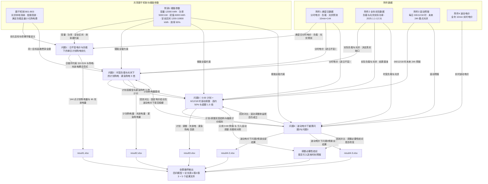

# C 题 微网与外部电网电力调控策略

> 源文件：`CUMCM2026Problems\C题\C题.pdf`（共 3 页，已全文抽取）
> 题名锚点：`C 题 微网与外部电网电力调控策略`
> 附件：附件1.xlsx、附件2.xlsx、附件3.xlsx、附件4.xlsx、附件5（5 个结果模板）
> 排除的题名前样板（不计入翻译台账）：`2026 年高教社杯全国大学生数学建模竞赛题目`、`（请先阅读"全国大学生数学建模竞赛论文格式规范"）`、页码 `1/2/3`

---

## 1. 整题概览

**研究系统**：一个**非孤岛式微网**（含光伏发电、储能设备、小区负载）与**外部电网（外网）**之间的购电—充放电联合调控系统。微网可以在外网电价低或光伏有余电时给储能充电，在电价高时放电，通过"低储高放"赚取价差；同时必须保证对小区的供电不低于负载。

**已知信息**：单日分时电价 + 典型日负载 + 光伏预测（附件1）；全年 365 天、每天 144 个 10 分钟点的实际负载与光伏实际功率（附件2）；全年每天 0:00／6:00／12:00／18:00 发布的未来 24 小时整点光伏预报（附件3）；全年 365 天 × 144 点的实时波动电价（附件4）；储能设备参数（附录1：容量 12000 kWh、最大充放电功率 5000 kW、初始电量 6000 kWh、安全区间 1200–10800 kWh、充放电效率 90%）。

**要产出的决策**：每个 10 分钟时段的**计划购电量**、**调整购电量**、**紧急购电量**，以及储能的**充／放电量**与**储电量轨迹**；目标是"满足负载"前提下**最小化购电总费用**。

**四问的递进结构**：

1. **问题1｜确定性基准**：电价与负载逐日不变、已知一天的光伏预测 → 单日确定性优化 + 储能日循环约束 → 建立"购电—充放电"耦合建模范式。
2. **问题2｜引入时变与偏差惩罚**：电价逐日不变但负载／光伏随时间变化，允许计划与实际出现缺口，缺口按**紧急购电（5 倍电价）**结算 → 基础电费仍按计划量计。
3. **问题3｜引入滚动预报与调整机制**：0:00 定计划，6／12／18 时可用新预报调整；少用付**违约 50%**，多用付**1.5 倍**；并要求论证"是否需要引入其他时刻的预报"。
4. **问题4｜电价也随机化**：改用附件4的实时波动电价，重算问题2与问题3两个情景，检验前面结论的稳健性。

**最终交付物**：四问的数学模型 + 论文中的表 1／表 2／表 3（按指定日期）+ 5 个结果文件 `result1.xlsx`、`result2.xlsx`、`result3.xlsx`、`result4-2.xlsx`、`result4-3.xlsx`。

---

## 2. 逐句题意翻译与联动表

| 编号 | 题干原句 | 通俗而精确的翻译 | 明示条件/数据 | 隐含建模信号 | 与前后内容的联动 | 漏读后果 | 后文必须出现的证据 | 来源页码/位置 |
|---|---|---|---|---|---|---|---|---|
| S00 | C 题　微网与外部电网电力调控策略 | 本题对象是"微网"这一小型发用电系统与"外部电网"之间的电力交易与调度，核心产出是一套**购电与充放电调控策略** | 题名即研究对象与决策类型 | `entity`+`task`：决策变量是"策略"（时间序列），不是单点的数值 | 为全部四问设定对象边界：只考虑购电侧与储能侧，不考虑售电上网 | 误以为可以向外网卖电、套利 | 全文只出现购电方向，不出现上网售电 | 第1页 题名行 |
| B01 | 微网是为解决光伏发电等分布式能源本地消纳，减少并网问题而快速发展起来的小型发用电系统。 | 微网=小型"发电+用电"一体化系统，存在的意义是让光伏等分布式电源在**本地就被消纳掉**，从而减少大规模并网带来的问题 | 微网是"发用电系统"，含分布式电源与本地负荷 | `context`：说明为什么强调"本地消纳"——光伏发电优先自用，这是后续"光伏优先供电"顺序的依据 | 支撑 B02 的"有剩余电量时充电"这一动作顺序 | 误把光伏当作可自由处置的外售电源 | 论文中明确光伏优先满足负载、余量再充电 | 第1页 背景段第1句 |
| B02 | 出于经济方面的考虑，非孤岛式微网可在外部电网（以下简称外网）电价较低或分布式能源有剩余电量的时间段，为储能设备充电，并在外网电价较高的时间段释放电能。 | 微网**并网运行**（非孤岛），因此可在两个时机充电：①外网电价低；②光伏等分布式电源有富余。在电价高的时段让储能放电 | "非孤网"→可自由与外网交易；"外网"为下文统一简称；两套充电触发条件（低价／余电） | `mechanism`+`objective`：明确"低储高放"套利机制，且**"余电充电"与"低价充电"是并列触发条件**，不是只有一个 | 定义全题的经济动机；B03 把它转成优化目标；问题1–4 全部沿用 | 只做"低价充电"而漏掉"光伏余电充电"，浪费零成本电量 | 模型中出现"光伏出力大于负载时的余量可充电"约束或说明 | 第1页 背景段第2句 |
| B03 | 微网与外网的调控目的是：利用小区负载、光伏发电量和储能设备的当前储电量等数据，尽可能精准地给出微网的购电量和储能设备的充放电量，使得微网提供的电力既能满足小区的负载，又尽可能节省微网的购电费用。 | 决策所依据的信息集是**负载、光伏、当前储电量**三类；决策变量是**购电量**与**充放电量**；目标是双层的：先**保证供电不低于负载**（硬约束），再**最小化购电费用**（目标函数） | 信息集：负载／光伏／储电量；决策变量：购电量、充放电量；目标：满足负载 + 省电费 | `objective`+`constraint`+`deliverable`：①"满足负载"是硬约束不是软目标；②"尽可能精准"暗示要给出**逐时段时间序列**而非日均；③"当前储电量"说明储能状态是**跨时段耦合的状态变量** | 是全题目标函数的来源；"储电量"作为状态变量直接引出附录1的容量／功率／效率约束与跨天递推 | 把"满足负载"写成罚函数放进目标，导致允许断电；或忽略储电量的状态递推 | 目标函数与约束分别写出"供电 ≥ 负载"和"min 购电费" | 第1页 背景段第3句 |
| Q1-01 | 问题 1　若每天的电价和小区负载相同，同时给出光伏发电功率一天的预测数据，要求微网提供的电能不可低于小区负载，且储能设备在 0:00 和 24:00 的储电量相同。 | 问题1的简化假设：**电价曲线与负载曲线每天都一样（逐日不变，但一天之内随时段变化）**，并且已知当天光伏功率预测；要求①供电量 ≥ 负载（能量口径）；②储能**日循环**：0:00 与 24:00 储电量相等 | 电价逐日相同；负载逐日相同；光伏有一天预测数据；供电 ≥ 负载；S(0)=S(24) | `given`+`constraint`：①"每天相同"是**日间**相同，不是一天之内恒定；②"不可低于"是**能量(kWh)**口径；③ S(0)=S(24) 是**等式终端约束**，使单日问题可独立求解、可日复一日重复 | 依赖 B01–B03 的机制；依赖附录1储能参数；其"购电—充放电耦合模型"被问题2继承 | 误读为"一天内电价恒定"→退化成 trivial；或忽略日循环约束导致储能被掏空 | 模型中显式写出 S(0)=S(24) 与逐时段能量平衡 | 第1页 问题1第1句 |
| Q1-02 | 请在每天 0:00 制定微网当天的计划购电策略的数学模型。 | 决策时点是**每天 0:00**，一次性制定**全天**的购电（及配套充放电）计划；要交付的是**数学模型**，不是只给数值结果 | 决策时刻 0:00；决策范围：全天；产出：数学模型 | `task`：日是决策周期，0:00 是"信息截止线"（只能使用 0:00 及之前可得的信息） | 引出 Q1-03 的具体数值结果；"0:00 制定"这一设定被问题2、3 完整继承 | 把模型写成实时滚动决策，违背题设 | 论文中给出完整的 0:00 日前优化模型（变量／约束／目标） | 第1页 问题1第2句 |
| Q1-03 | 根据附件 1 和附录 1 中的数据，给出具体的计划购电策略，在论文中以表 1 的格式给出指定时间段的购电量（单位：kWh）及全天的购电量（单位：kWh）和购电费（单位：元）， | 用**附件1（单日电价／负载／光伏预测）+ 附录1（储能参数）**算出具体策略；论文中按表1格式填报：6 个指定 10 分钟时段的购电量(kWh)，以及全天购电量(kWh)与全天购电费(元) | 数据源：附件1 + 附录1；输出单位：kWh／kWh／元；表1格式 | `deliverable`：①购电量是**电量 kWh**，而负载／光伏是**功率 kW**，必须做 Δt=1/6 h 的换算；②"全天购电费"是独立评分项 | 依赖 Q1-01/Q1-02；与 Q1-05 的 result1.xlsx 是同一套结果的两种呈现 | 功率与电量混用，数值差 6 倍；漏报全天购电费 | 表1中 6 个时段值 + 全天购电量 + 全天购电费，单位标注齐全 | 第1页 问题1第3句 |
| Q1-04 | 以表 2 的格式给出储能设备在指定时间段的充放电量及 0:00 和 24:00 的储电量（单位：kWh）， | 另按表2格式填报：6 个**4 小时块**（0–4、4–8、…、20–24 时）的充电量与放电量，以及 0:00 与 24:00 两个时刻的储电量(kWh) | 输出：6 个 4h 块的充／放电量；0:00 与 24:00 储电量；单位 kWh | `deliverable`：充放电是**分块汇总量**，与购电的 10 分钟粒度不同；充、放电**分列两列**（同一块内可既有充又有放，需自行判断是否允许） | 与 Q1-01 的 S(0)=S(24) 直接呼应——表2正是该约束的证据 | 只报净充放电量而丢失充／放电分列；未验证 0:00 与 24:00 相等 | 表2六行填齐，且 0:00 储电量 = 24:00 储电量 | 第1页 问题1第4句 |
| Q1-05 | 并将完整的计划购电策略保存到文件 result1.xlsx 中（模板文件见附件 5）。 | 除论文表格外，还要把**完整**（全天 144 个 10 分钟点）的计划购电量与充放电结果写入 `result1.xlsx` | 输出文件名 result1.xlsx；模板在附件5 | `deliverable`：结果文件是**单独评分的交付物**，必须严格照模板的sheet名与行列口径填写 | 与 Q1-03、Q1-04 是同一结果的完整版；result1 的"计划购电量／充放电量"双表结构被 result2/3/4 沿用扩展 | 只交论文表格不交文件，或改了模板结构 | 提交 result1.xlsx，两个工作表按原模板结构填满 | 第1页 问题1第5句 |
| T1 | 表 1　微网在指定时间段的购电量及全天的购电量和购电费 时间段 购电量 ×3 列 10:00-10:10／12:00-12:10／14:00-14:10／16:00-16:10／18:00-18:10／20:00-20:10 全天购电量　全天购电费 | 表1是**3 列 × 2 行**的"时间段—购电量"对照表，共 6 个指定时段，均为**10 分钟区间**（起止式标签），下方另列全天购电量与全天购电费 | 指定时段：10:00-10:10、12:00-12:10、14:00-14:10、16:00-16:10、18:00-18:10、20:00-20:10；末行：全天购电量、全天购电费 | `deliverable`+`constraint`：①确认决策粒度是 10 分钟；②标签采用**"起—止"区间式**（如 10:00-10:10），与附件数据列的**单点时刻式**（00:10:00）口径不同，存在对齐歧义 | 问题2 要求"按表1格式"给出指定日期结果；问题3 同样复用表1 | 区间标签与附件时刻标签错位一格，导致所报时段实际偏移 10 分钟 | 论文中说明时间标签口径，表1的6个值与附件时间轴可一一对应 | 第1页 表1 |
| T2 | 表 2　储能设备在指定时间段的充放电量及 0:00 和 24:00 的储电量 时间段 充电量 放电量 ×2 组 0:00-4:00／4:00-8:00／8:00-12:00／12:00-16:00／16:00-20:00／20:00-24:00 0:00 储电量　24:00 储电量 | 表2是 6 个**4 小时整块**的充电量与放电量（充、放各一列），末尾附 0:00 与 24:00 的储电量 | 分块：0:00-4:00、4:00-8:00、8:00-12:00、12:00-16:00、16:00-20:00、20:00-24:00；末行 0:00／24:00 储电量 | `deliverable`：4 小时块是**汇总口径**，与购电的 10 分钟口径并存，说明结果需支持多尺度输出 | 与 Q1-04、附录1的安全区间共同构成储能结果；被问题2、3 复用 | 把 4h 块当成瞬时值或平均值填报 | 表2六行 + 两个储电量，且与表1的策略自洽 | 第1页 表2 |
| Q2-01 | 问题 2　若每天的电价相同，而小区负载和光伏发电功率随时间变化，且微网提供的电能不可低于小区负载， | 问题2 放松问题1：电价仍**逐日不变**（仍取附件1的分时电价），但**负载与光伏随时间（逐时段、逐日）变化**；供电量仍不可低于负载 | 电价逐日相同；负载时变；光伏时变；供电 ≥ 负载 | `given`+`constraint`：与问题1的差别恰是"负载不再逐日相同"，因此问题变成**逐日滚动、跨天状态耦合**的多日问题 | 直接继承 Q1 的模型骨架；依赖附件2提供时变数据 | 仍按单日典型日建模，全年只用一天数据 | 模型按日递推，逐日给出结果 | 第1页 问题2第1句 |
| Q2-02 | 如果低于负载，需向外网紧急购电，其电价是交易时刻电价的 5 倍。 | 一旦实际供电低于负载，缺口部分必须**紧急向外网购电**补足；该部分电量的单价 = **交易时刻电价的 5 倍** | 紧急购电触发：供电 < 负载；计价：5 × 交易时刻电价；只对**缺口部分**计价 | `mechanism`+`constraint`：①紧急购电是**被动补足缺口**，不是主动采购；②5 倍是**乘数**作用在当时的电价上；③"交易时刻"= 缺口发生的那个时段 | 引出 Q2-03 的费用结算规则；问题3、问题4 都保留紧急购电机制 | 把 5 倍作用到全部购电量上；或忽略"补足缺口"这一被动属性 | 紧急购电量 = 缺口量，费用 = 5×p_t×缺口量 | 第1页 问题2第2句 |
| Q2-03 | 除紧急购电费用外，其他时间段的购电费用均按计划购电量计算。 | 结算规则：**正常购电费用按"计划购电量"计价，不按实际购电量重算**；紧急购电费用在此之外**额外叠加** | 计价基数：计划购电量；紧急费用额外计入 | `mechanism`：这是极易漏的关键结算规则——实际购电与计划的偏差**不改变**基础电费，只在产生缺口时增加 5 倍紧急费用 | 与 Q2-02 构成问题2 的完整费用公式；问题3 在此基础上再加调整费用 | 用实际购电量重算基础电费，导致费用结构完全错误 | 总费用公式中"正常部分按计划量计价"明确写出 | 第1页 问题2第3句 |
| Q2-04 | 请在每天 0:00 制定微网当天的计划购电策略。 | 与问题1一样，**每天 0:00 一次性制定当天全天的计划** | 决策时刻 0:00；决策范围当天 | `task`+`constraint`：0:00 之后的新信息在制定计划时**不可用** | 与 Q1-02 同构；问题3 在此基础上增加"其他时刻可调整" | 使用 0:00 之后的未来信息制定计划（信息泄漏） | 论文说明计划所依据的信息集截止于 0:00 | 第1页 问题2第4句 |
| Q2-05 | 根据附件 1 中的电价和附件 2 中的数据，在每天 0:00 制定当天的计划购电策略。 | 数据源明确：**电价取附件1**（分时、逐日不变），**负载与光伏取附件2**（全年 365 天 × 144 点实际值） | 电价←附件1；负载／光伏←附件2 | `given`：附件2 的两个 sheet 分别是"小区负载"与"光伏发电实际功率"，注意是**实际**功率而非预测值 | 与 Q2-04 配套；是问题2 唯一的数据来源（问题2**没有**给光伏预报数据） | 误用附件3 的预报数据做问题2；或把"实际功率"当成"预测功率" | 论文中写明问题2的信息集与数据来源 | 第1页 问题2第5句 |
| Q2-06 | 在论文中按表 1 和表 2 的格式给出表 3 中指定日期的结果，按表 3 的格式给出紧急购电的结果， | 论文中要给出**四个指定日期**（见表3）的三类结果：表1格式（购电量）、表2格式（充放电与储电量）、表3格式（紧急购电） | 指定日期：2025.3.20、2025.6.21、2025.9.23、2025.12.21；三类表格 | `deliverable`：四天要**分别**给出，不能合并或平均；且表3的紧急购电是新增的第三类输出 | 依赖 T1/T2/T3 三个表格式；问题3 同样要求"按表1、表2和表3的格式给出指定日期的结果" | 只给全年汇总而不给四个指定日期；或漏掉表3 | 四个指定日期各有一套表1／表2／表3结果 | 第1页 问题2第6句 |
| Q2-07 | 并将完整的购电策略保存到文件 result2.xlsx 中（模板文件见附件 5）。 | 完整结果（**全年**）写入 `result2.xlsx`，含计划购电量、充放电量、紧急购电量三个工作表 | 输出文件 result2.xlsx | `deliverable`：三个 sheet 缺一不可 | 与 D08–D10 的模板说明配套 | 漏填"紧急购电量"工作表（即使无紧急购电也应说明） | 提交 result2.xlsx 且三表齐全 | 第1页 问题2第7句 |
| T3 | 表 3　微网在指定日期的紧急购电量 2025.3.20／2025.6.21／2025.9.23／2025.12.21 时间段 购电量 ×4 组 | 表3按**四个指定日期**分四组，每组列出该日发生紧急购电的**时间段**与**购电量**（可有多行，也可为空） | 指定日期：2025.3.20、2025.6.21、2025.9.23、2025.12.21；列：时间段、购电量 | `deliverable`：①四个日期跨春／夏／秋／冬，隐含**季节性对比**意图（光伏出力与负载差异显著）；②紧急购电是**稀疏事件**，无发生时需明确说明 | 被 Q2-06、Q3-08 引用；表4给出其填写样例 | 只报其中一天；或未说明"无紧急购电"的情况 | 四个日期的紧急购电结果（有则列时段与电量，无则注明） | 第2页 表3 |
| Q3-01 | 问题 3　在每天 0:00、6:00、12:00 和 18:00 可获得未来 24 小时整点的光伏发电功率预报。 | 新增信息渠道：每天**4 个固定时刻**发布预报，每次给出**未来 24 小时**、**整点（1 小时）**粒度的光伏功率预报 | 发布时刻：0:00、6:00、12:00、18:00；预报长度：未来 24 h；粒度：整点；对象：光伏功率 | `given`+`constraint`：①预报是**小时粒度**，而决策是 10 分钟粒度，存在**尺度转换**需求；②每次预报覆盖未来 24 小时（跨天） | 数据源为附件3；与 Q3-02 的"可调整"直接相连；问题4 仍需用附件3 | 把 24 小时预报误读为"仅当天剩余时段"；忽略小时→10 分钟的降尺度 | 论文中说明预报的使用方式与尺度处理 | 第2页 问题3第1句 |
| Q3-02 | 可根据 0:00 的预报，制定当天的计划购电策略，也可根据其他时刻的预报，调整购电策略。 | 形成"**计划 + 调整**"两层结构：0:00 的预报用于制定**计划购电量**；6:00／12:00／18:00 的预报可用于**调整**购电量（不是必须调整） | 计划依据：0:00 预报；调整依据：6/12/18 时预报；调整是"可"而非"必须" | `task`+`mechanism`：①"可"字意味着**是否调整本身是决策变量**，这正是 Q3-09 要分析的问题；②调整发生在**剩余时段**，已执行部分不可更改 | 依赖 Q3-01；引出 Q3-03／Q3-04 的调整计价规则；依赖 Q2 的计划层模型 | 把调整当成强制动作；或允许回溯修改已执行时段的购电量 | 模型中区分"已锁定时段"与"可调整时段" | 第2页 问题3第2句 |
| Q3-03 | 计划购电量高于调整购电量的部分，违约电价是交易时刻电价的 50%。 | 当调整后**买得比计划少**时，少买的差额要按**交易时刻电价的 50%** 支付违约（补偿）费用 | 触发：计划量 > 调整量；计价：0.5 × p_t × 差额 | `mechanism`+`constraint`：①50% 是**额外支付的违约金**，不是"退款"或"折扣"；②只对**差额部分**计价 | 与 Q3-04 构成对称的双向偏差计价；与 Q3-05 共同组成总费用 | 把 50% 当成"只收半价"而计入正常电费，符号与性质全错 | 总费用公式中含 0.5×p_t×(计划−调整)⁺ 的违约项 | 第2页 问题3第3句 |
| Q3-04 | 调整购电量高于计划购电量的部分，超出部分的电价是交易时刻电价的 1.5 倍。 | 当调整后**买得比计划多**时，多出的部分按**交易时刻电价的 1.5 倍**计价 | 触发：调整量 > 计划量；计价：1.5 × p_t × 超出部分 | `mechanism`：①只对**超出部分**加价，未超出部分仍按原价；②1.5 倍与 Q2 的 5 倍是**不同机制**，不可混淆 | 与 Q3-03 对称；被问题4 继承 | 把超出部分与紧急购电的 5 倍混为一谈 | 总费用公式中含 1.5×p_t×(调整−计划)⁺ 项 | 第2页 问题3第4句 |
| Q3-05 | 总的购电费用包括计划购电费用、紧急购电费用和调整购电量的相关费用。 | 问题3 的总费用由**三部分**构成：①计划购电费用；②紧急购电费用（沿用问题2 的 5 倍机制）；③调整相关费用（含违约 50% 与超额 1.5 倍） | 费用三项构成 | `objective`：三项**并列相加**，不是三选一；说明问题3 完全继承问题2 的紧急购电机制 | 依赖 Q2-02／Q2-03；是问题3 目标函数的完整定义 | 目标函数漏掉紧急购电项或漏掉违约项 | 目标函数显式写出三项费用之和 | 第2页 问题3第5句 |
| Q3-06 | 请在上述条件下，建立微网当天购电策略的数学模型。 | 在"4 次预报 + 可调整 + 双向偏差计价 + 紧急购电"这些条件下，建立**当天**的购电策略模型 | 建模范围：当天；条件：上述全部 | `task`：要求的是一个**可滚动执行**的模型（计划层 + 调整层），不是单阶段模型 | 依赖 Q3-01 至 Q3-05 | 只给计划层模型，未建模调整层 | 论文中给出计划层与调整层两个（或两阶段）模型 | 第2页 问题3第6句 |
| Q3-07 | 根据附件 1 中的电价、附件 2 中的小区负载和光伏发电及附件 3 的光伏发电预报数据，在每天 0:00 制定当天的计划购电策略，在其他预报时刻制定调整购电策略。 | 问题3 的数据分工明确：**电价←附件1**（仍为分时固定电价）、**负载与光伏实际←附件2**、**光伏预报←附件3**；0:00 定计划，6/12/18 定调整 | 电价←附件1；负载／光伏实际←附件2；预报←附件3 | `given`：这是"**预报用于决策、实际用于结算**"的典型结构——实际值决定真实缺口与紧急购电，预报只用于决策 | 依赖 Q3-01；问题4 将电价源换成附件4 | 用附件2 的实际光伏直接做计划（信息泄漏），使调整机制失去意义 | 论文明确"计划/调整用预报，缺口结算用实际" | 第2页 问题3第7句 |
| Q3-08 | 请在论文中按表 1、表 2 和表 3 的格式给出表 3 中指定日期的结果，并将完整的购电策略保存到文件 result3.xlsx 中（模板文件见附件 5）。 | 论文中给出四个指定日期（表3 日期）的表1／表2／表3 三类结果；完整全年结果写入 `result3.xlsx`（四个工作表） | 指定日期同表3；输出文件 result3.xlsx；四类 sheet | `deliverable`：比 result2 多一个"**调整购电量**"工作表 | 依赖 T1/T2/T3；与 D11–D14 模板配套 | 漏交"调整购电量"表；或四个指定日期结果不完整 | 提交 result3.xlsx 且四表齐全，论文含指定日期三表 | 第2页 问题3第8句 |
| Q3-09 | 请分析是否需要引入其他时刻的预报制定调整购电策略。 | 必须**论证**滚动调整的必要性：比较"只用 0:00 预报"与"引入 6/12/18 时预报并调整"两种做法的费用与风险，给出结论 | 任务：分析"是否"；比较基准：只用 0:00 预报 | `validation`：这是**独立的论证型交付物**，需要对照实验与量化证据（费用差、改进率、鲁棒性），不能只给一句结论 | 是问题3 的收尾；其结论会被问题4 的波动电价情景再次检验 | 只给结论不给对照数据；或未做显著性／稳健性说明 | 论文中有"引入 vs 不引入"的对照表与明确结论 | 第2页 问题3第9句 |
| Q4-01 | 问题 4　实际上，外网的电价也是实时波动的。请针对波动电价，建立微网当天购电策略的数学模型。 | 进一步放松：**电价本身也随时间实时波动**（不再逐日相同、不再固定分时），需要重建模型 | 电价：实时波动 | `given`+`task`：电价从"已知确定性参数"变为"**时变且需预测的量**"，模型的费用系数随之改变 | 依赖 Q2／Q3 的模型骨架；数据源换成附件4 | 仍沿用附件1 的固定电价做问题4 | 模型中电价记为时变参数 p_t，数据来源标注为附件4 | 第2页 问题4第1句 |
| Q4-02 | 根据附件 2 中的小区负载和光伏发电、附件 3 中的光伏发电预报和附件 4 中的电价数据，在波动电价下重新计算问题 2 和问题 3。 | 问题4 的数据源：**负载与光伏←附件2**、**预报←附件3**、**电价←附件4**（注意**不再用附件1 的电价**）；并把**问题2 情景**和**问题3 情景**各重算一遍 | 负载／光伏←附件2；预报←附件3；电价←附件4；重算对象：问题2、问题3 | `task`+`constraint`：①"重新计算问题2和问题3"意味着**紧急购电机制（问题2）与计划—调整机制（问题3）都要保留**，只是电价换成波动电价；②注意**没有附件1** | 依赖 Q2、Q3 全部模型；产出两个文件 | 只重算其中一问；或仍用附件1 电价 | 两个情景分别给出结果，电价来源标注为附件4 | 第2页 问题4第2句 |
| Q4-03 | 请在论文中给出相应的计算结果，并将完整购电策略分别保存到文件 result4-2.xlsx（对应于问题 2）和 result4-3.xlsx（对应于问题 3）中（模板文件见附件 5）。 | 论文给出波动电价下的计算结果；完整结果**分别**存入两个文件：`result4-2.xlsx`=问题2 情景、`result4-3.xlsx`=问题3 情景 | 输出：result4-2.xlsx、result4-3.xlsx | `deliverable`：文件与情景的对应关系**不可互换** | 依赖 Q4-02；与 D15 模板说明配套 | 两个文件内容对调；或只交一个文件 | 提交两个文件且内容与题面对应 | 第2页 问题4第3句 |
| A01 | 储能设备的最大容量为 12000 kWh，最大充放电功率为 5000 kW。 | 储能**容量上限 12000 kWh**；**充、放电功率上限均为 5000 kW**（功率单位 kW，需换算成每 10 分钟能量上限 ≈ 833.33 kWh） | 容量 12000 kWh；功率上限 5000 kW | `constraint`：两个不同量纲的上限（电量 vs 功率）；功率上限在 10 分钟粒度下等价于每时段 ≤ 5000/6 kWh | 与 A03 的安全区间共同约束全部四问；与 B03 的"当前储电量"状态变量配套 | 把 5000 kW 当成 5000 kWh/时段，放大 6 倍 | 约束中同时出现 S_t ≤ 12000 与 单时段充/放电 ≤ 833.33 kWh | 第2页 附录1第1句 |
| A02 | 假设 2025 年 1 月 1 日 0:00 的电量为 6000 kWh。 | 全题唯一的初始条件：**2025-01-01 0:00 储电量 = 6000 kWh**，是全年递推的起点 | 初值 6000 kWh；时点 2025-01-01 0:00 | `given`：①明确初始状态，使多日问题可解；②初值正好是安全区间的中点，也是容量的 50% | 与 D02（附件2 起于 2025.1.1）在时间轴起点上一致；与结果文件"从 2.1 开始"形成张力（见完整性核验） | 忽略初值，导致第一天结果不可复现 | 论文中写明 S(2025-01-01 00:00)=6000 kWh | 第2页 附录1第2句 |
| A03 | 为了避免过度充电或放电，在后继的充放电过程中，储能设备的电量必须保持在 1200-10800 kWh 之间， | 全时段硬约束：**1200 ≤ S_t ≤ 10800 kWh**（分别是容量的 10% 与 90%），适用于初值之后的**所有**时刻 | 安全区间 [1200, 10800] kWh；适用范围：后继充放电全过程 | `constraint`：①是**硬约束**，不是软目标；②注意 1200 = 12000×10%，10800 = 12000×90%；③"后继的充放电过程中"意味着初值之后的每一步都要满足 | 与 A01、A02、A04 共同构成储能约束集，四问通用 | 只约束末端不约束中间时刻；或把区间当成 [0,12000] | 约束中出现 1200 ≤ S_t ≤ 10800，且结果中无越界 | 第2页 附录1第3句 |
| A04 | 储能设备的充放电效率为 90%。 | 储能**充电与放电过程均有 90% 的效率**（存在 10% 的能量损耗） | 效率 90% | `mechanism`+`constraint`：①"充放电效率"存在歧义——是充电、放电**各** 90%（往返约 81%），还是往返合计 90%；②效率使"低价充高价放"存在约 19% 的能量损失，直接影响套利是否划算的判据 | 与 B02 的套利机制直接相关：只有价差大于效率损失时充放电才有意义；四问通用 | 忽略效率，高估套利收益；或对单／双向效率处理不一致 | 论文明确效率的处理口径并给出能量平衡式 | 第2页 附录1第4句 |
| D01 | 附件 1　提供某天不同时间的电价（单位：元/kWh）、小区负载（单位：kW）和光伏发电预测功率（单位：kW），表中的 0:00+1 表示第二天凌晨 0:00，即当天 24:00（下同）。 | 附件1 = **单日**的三条曲线：电价(元/kWh)、负载(kW)、光伏预测功率(kW)；时间列最后一行 `0:00+1` 就是当天的 24:00；"（下同）"表示附件2、附件4 也采用同一约定 | 数据源：附件1；字段：电价、小区负载、光伏发电预测功率；单位：元/kWh、kW、kW；时间约定 0:00+1 = 24:00 | `given`+`definition`：①三条曲线的量纲不同（电价是单价，负载与光伏是功率）；②"下同"是跨附件统一约定，影响附件2／附件4 的时间轴读法 | 供问题1 全量使用；供问题2、问题3 提供电价；**问题4 不使用附件1** | 把 0:00+1 当成额外的一天；或忽略"下同"导致附件2／4 时间轴错读 | 论文说明时间轴约定与单位换算 | 第2页 附录2 附件1 |
| D02 | 附件 2　提供 2025.1.1-12.31 每天不同时间的小区负载（单位：kW）和光伏发电实际功率（单位：kW）。 | 附件2 = **全年 365 天**、每天 144 个 10 分钟点的**负载实际值**与**光伏实际功率**（注意是"实际"，不是预测） | 时间范围 2025.1.1–12.31；字段：小区负载、光伏发电实际功率；单位 kW；两个工作表 | `given`：①"实际"二字是关键词——实际值用于**结算与缺口判定**；②数据起于 1.1，而交付结果起于 2.1，二者不一致 | 供问题2、问题3、问题4 使用；与 A02 的初始时刻（1.1 0:00）在时间轴上对齐 | 把"实际功率"当作预测值用于制定计划（信息泄漏） | 论文区分"实际值"与"预报值"的用途 | 第2页 附录2 附件2 |
| D03 | 附件 3　提供 2025.1.1-12.31 每天 0:00、6:00、12:00 和 18:00 发布的未来 24 小时整点的光伏发电功率预报（单位：kW）。 | 附件3 = 全年每天 4 次发布，每次给出**未来 24 个整点**的光伏预报功率(kW) | 时间范围 2025.1.1–12.31；发布时刻 0/6/12/18 时；内容：未来 24 h 整点预报；单位 kW | `given`：①预报是**小时粒度**，需降尺度到 10 分钟决策粒度；②每次预报覆盖未来 24 h，可跨到次日 | 供问题3、问题4 使用；**问题2 不使用附件3** | 把"预报1小时"误解为"当天 1:00"而非"发布后 1 小时" | 论文说明预报的对齐方式与降尺度方法 | 第2页 附录2 附件3 |
| D04 | 附件 4　提供 2025.1.1-12.31 每天不同时间的电价（单位：元/kWh）。 | 附件4 = 全年 365 天、每天 144 个 10 分钟点的**实时波动电价**（元/kWh） | 时间范围 2025.1.1–12.31；字段：电价；单位 元/kWh | `given`：与附件1 的"典型日固定电价"形成对照，是问题4 的**唯一电价来源** | 仅供问题4 使用；使问题4 的电价由确定性变为时变序列 | 在问题4 中仍用附件1 的分时电价 | 问题4 的电价来源明确标注为附件4 | 第2页 附录2 附件4 |
| D05 | 附件 5　结果文件夹 | 附件5 是一个**文件夹**，内含 5 个结果模板文件，规定了所有交付文件的结构 | 附件5 = 结果模板文件夹 | `deliverable`：模板的 sheet 名、列名、行列数都是硬约束 | 与 D06–D15 配套；约束 result1–result4 的全部输出 | 自行新建文件结构而不照模板 | 提交文件沿用模板 sheet 名与列名 | 第3页 附件5 标题 |
| D06 | result1.xlsx　问题 1 的结果文件：在"计划购电量"工作表中保存间隔 10 分钟的购电量（单位：kWh）。 | `result1.xlsx` 的第 1 个工作表"计划购电量"：按**10 分钟**间隔保存全天购电量(kWh)，共 144 行 | 文件名 result1.xlsx；sheet：计划购电量；粒度 10 min；单位 kWh | `deliverable`：确认 10 分钟为决策粒度，144 点/天 | 与 Q1-05、D07 配套 | 用小时粒度或 15 分钟粒度填报 | 计划购电量表 144 行，单位 kWh | 第3页 result1 说明 |
| D07 | 在"充放电量"工作表中保存储能设备在指定时间段的充电量和放电量（单位：kWh），及 0:00 和 24:00 的储电量（单位：kWh）。 | `result1.xlsx` 的第 2 个工作表"充放电量"：6 个 4 小时块的**充电量**与**放电量**(kWh)，以及 0:00 与 24:00 的储电量(kWh) | sheet：充放电量；内容：分块充／放电量 + 端点储电量；单位 kWh | `deliverable`：充放电量与购电量**分表存放**，粒度不同 | 与 T2、Q1-04 配套；验证 S(0)=S(24) | 只报净量；或漏填端点储电量 | 充放电量表六行 + 两个端点储电量 | 第3页 result1 说明 |
| D08 | result2.xlsx　问题 2 的结果文件：在"计划购电量"工作表中保存 2025.2.1-12.31 每天 0:00 制定的间隔 10 分钟的计划购电量（单位：kWh）。 | `result2.xlsx` 的"计划购电量"表：覆盖 **2025.2.1–12.31（334 天）**，每天 144 个 10 分钟点的计划购电量 | 日期范围 2025.2.1–12.31；粒度 10 min；单位 kWh；sheet：计划购电量 | `deliverable`：①**起始日是 2 月 1 日，不含 1 月**；②"每天 0:00 制定"强调信息截止线 | 与 Q2-07 配套；与 D02（数据起于 1.1）不一致，需专门说明 1 月的处理方式 | 从 1.1 开始填报；或天数不对（334 天） | 计划购电量表 334 行 × 144 列 | 第3页 result2 说明 |
| D09 | 在"充放电量"工作表中保存储能设备在 2025.2.1-12.31 指定时间段的充放电量（单位：kWh），以及在 0:00 和 24:00 的存储电量（单位：kWh）。 | `result2.xlsx` 的"充放电量"表：**334 天 × 6 个 4 小时块**的充／放电量，外加每天 0:00 与 24:00 的储电量 | 日期范围 2025.2.1–12.31；分块：6 个 4h 块；含端点储电量；单位 kWh | `deliverable`：模板中以 `⁝` 省略号示意，需**自行扩展到全部 334 天** | 与 D08 同期；端点储电量构成跨天递推的证据链 | 只填模板中已列出的 3 天 | 充放电量表覆盖 334 天 | 第3页 result2 说明 |
| D10 | 在"紧急购电量"工作表中保存 2025.2.1-12.31 紧急购电的时间段和购电量（单位：kWh），填写方法如表 4 所示。 | `result2.xlsx` 的"紧急购电量"表：按**日期—紧急购电时间段—紧急购电量**三列填报，一天可有多行；填写格式参见表4 | sheet：紧急购电量；列：日期、时间段、购电量；单位 kWh | `deliverable`：稀疏表，无紧急购电的日期可留空（需与论文说明一致） | 与 Q2-02、T3、T4 配套 | 用 10 分钟固定列而不用"时间段区间"的写法 | 紧急购电量表按表4 格式填写 | 第3页 result2 说明 |
| T4 | 表 4　紧急购电填写示例 日期／紧急购电时间段／紧急购电量 2025/3/1　13:00-13:30　100 2025/3/1　14:40-15:50　400 2025/3/1　16:10-16:30　50 | 表4 给出填写样例：同一天可有多条紧急购电记录，时间段写成**"起-止"区间**（可跨多个 10 分钟点），购电量为该区间内的总电量(kWh)，日期写成 `2025/3/1` 形式 | 列：日期、紧急购电时间段、紧急购电量；示例：13:00-13:30→100，14:40-15:50→400，16:10-16:30→50 | `deliverable`+`constraint`：①起止时刻**对齐到 10 分钟**（10/30/40/50 分），说明紧急购电以 10 分钟为基本单位聚合；②区间长度可变（20 min／70 min／20 min） | 与 D10 配套；result3、result4-2、result4-3 的紧急购电表同样适用 | 把时间段写成单点时刻；或未按 10 分钟对齐 | 紧急购电记录的时间段为 10 分钟整数倍的起止区间 | 第3页 表4 |
| D11 | result3.xlsx　问题 3 的结果文件：在"计划购电量"工作表中保存 2025.2.1-12.31 每天根据 0:00 预报制定的计划购电量（单位：kWh）。 | `result3.xlsx` 的"计划购电量"表：334 天 × 144 点，且明确是**依据 0:00 预报**制定的计划量 | 日期范围 2025.2.1–12.31；依据：0:00 预报；sheet：计划购电量 | `deliverable`：强调计划量的信息源是 0:00 预报（不得使用当天实际光伏） | 与 Q3-07、D12 配套 | 用实际值而非 0:00 预报生成计划量 | 论文与文件中计划量的信息源说明一致 | 第3页 result3 说明 |
| D12 | 在"调整购电量"工作表中保存根据其他预报制定的调整购电量（单位：kWh）。 | `result3.xlsx` 的"调整购电量"表：依据 **6:00／12:00／18:00 的预报**制定的调整后购电量（334 天 × 144 点） | sheet：调整购电量；依据：其他时刻预报；单位 kWh | `deliverable`：①这是相对 result2 新增的表；②"调整购电量"应理解为**调整后的最终购电量**（与计划量逐点对照），需与 Q3-03／Q3-04 的差额计价口径一致 | 与 Q3-02、Q3-03、Q3-04 直接相连；与 D11 构成"计划—调整"配对 | 误填为"调整增量"而非"调整后的量"（口径需自行声明并保持一致） | 论文明确"调整购电量"的口径定义 | 第3页 result3 说明 |
| D13 | 在"充放电量"工作表中保存储能设备在 2025.2.1-12.31 指定时间段**最终的**充放电量（单位：kWh），以及在 0:00 和 24:00 的存储电量（单位：kWh）。 | `result3.xlsx` 的"充放电量"表要填的是执行调整之后的**最终**实际充放电量（不是计划阶段的量） | 关键词"最终"；日期范围 2025.2.1–12.31；含端点储电量 | `deliverable`："最终"二字排除了"按计划值填报"的做法，必须与调整后的实际执行一致 | 与 D12 配套；与 D09 的区别在于是否经过调整 | 把计划阶段的充放电量当作最终结果填报 | 充放电量与调整购电量在能量平衡上自洽 | 第3页 result3 说明 |
| D14 | 在"紧急购电量"工作表中保存 2025.2.1-12.31 最终的紧急购电时间段与购电量（单位：kWh）。 | `result3.xlsx` 的"紧急购电量"表：调整执行后**最终**发生的紧急购电记录 | 关键词"最终"；格式同表4 | `deliverable`：同样是执行后的结果，而非计划值 | 与 D13、T4 配套 | 填报计划阶段的预估缺口 | 紧急购电记录与最终执行结果一致 | 第3页 result3 说明 |
| D15 | result4-2.xlsx 和 result4-3.xlsx　问题 4 的结果文件：在 result4-2.xlsx 中保存波动电价下问题 2 的全部结果；在 result4-3.xlsx 中保存波动电价下问题 3 的全部结果。 | 两个文件分别保存波动电价下"问题2 情景"与"问题3 情景"的**全部**结果：result4-2 含 计划购电量／充放电量／紧急购电量 三表；result4-3 含 计划购电量／调整购电量／充放电量／紧急购电量 四表 | 文件：result4-2.xlsx（问题2 情景，3 表）、result4-3.xlsx（问题3 情景，4 表） | `deliverable`："全部结果"= 与对应问题相同的完整表结构，只是电价换成附件4 | 与 Q4-02、Q4-03 配套；与 result2／result3 的结构一一对应 | 两个文件内容对调；或表数量不对 | 提交 result4-2（3 表）与 result4-3（4 表） | 第3页 result4 说明 |

**台账行数：51 行**（S00 1 行 + 背景 3 行 + 问题1 7 行 + 问题2 8 行 + 问题3 9 行 + 问题4 3 行 + 附录1 4 行 + 附录2 16 行）。

---

## 3. 核心术语与口径表

| 术语 | 题目原始定义 | 建议采用的精确口径 | 单位/范围 | 影响问题 | 歧义或注意事项 |
|---|---|---|---|---|---|
| 微网 | 小型发用电系统，用于分布式能源本地消纳 | 由"光伏发电 + 储能 + 小区负载"构成的本地系统，只从外网购电 | — | 全题 | 题面未提售电上网，默认不允许反向售电 |
| 外网／外部电网 | 外部电网（以下简称外网） | 唯一的外部电源与电价来源 | — | 全题 | 紧急购电、调整偏差均向外网结算 |
| 小区负载 | 附件字段"小区负载" | 逐时段功率需求 $P^{L}_t$；能量需求 = $P^{L}_t \cdot \Delta t$ | kW；10 min 粒度 | 全题 | 附件2 为"实际"负载，附件1 为典型日负载 |
| 光伏发电预测功率 | 附件1 字段 | 单日的光伏日前预测 $P^{PV,f}_t$ | kW | 问题1 | 问题1 视为已知且准确 |
| 光伏发电实际功率 | 附件2 字段 | 全年真实光伏出力 $P^{PV,a}_t$，用于**结算与缺口判定** | kW | 问题2/3/4 | "实际"≠"预测"，不得直接用于制定计划 |
| 光伏发电功率预报 | 附件3 | 每小时发布 4 次的未来 24 h 整点预报 $\hat P^{PV}_{t}$ | kW；小时粒度 | 问题3/4 | 需降尺度到 10 min；"预报1小时"=发布后第 1 小时 |
| 购电量 | 表1、模板字段 | 微网向外网购买的电量 $G_t$（**电量**口径） | kWh | 全题 | 与负载／光伏的 kW 差一个 $\Delta t = 1/6$ h |
| 计划购电量 | 每天 0:00 制定的购电量 | $G^{plan}_t$，0:00 一次性确定的全天序列 | kWh | 全题 | 是正常电费的计价基数（Q2-03） |
| 调整购电量 | 根据其他预报制定的调整购电量 | $G^{adj}_t$，6/12/18 时修订后的**购电量本身** | kWh | 问题3/4 | 歧义：是"调整后的量"还是"调整增量"？建议取"调整后的量"并在论文声明 |
| 紧急购电量 | 供电低于负载时向外网紧急购买 | $G^{em}_t = $ 缺口量（被动补足） | kWh | 问题2/3/4 | 只对缺口部分计价，单价 5 倍 |
| 交易时刻电价 | "其电价是交易时刻电价的 5 倍" | 指缺口／偏差发生那个时段的电价 $p_t$ | 元/kWh | 问题2/3/4 | 问题1–3 用附件1 分时电价，问题4 用附件4 实时电价 |
| 违约电价 | "违约电价是交易时刻电价的 50%" | 少买差额的**额外违约金** $=0.5 p_t (G^{plan}-G^{adj})^+$ | 元/kWh | 问题3/4 | 是"额外支付"，不是"半价结算" |
| 充电量／放电量 | 表2、模板字段 | $C_t$／$D_t$，分 4 小时块汇总 | kWh | 全题 | 充、放分列；同一块内是否允许同时充放需自行假设 |
| 储电量 | "储能设备的电量" | 状态变量 $S_t$，跨时段、跨天递推 | kWh | 全题 | 受 A01/A03 双重约束；问题1 另加 S(0)=S(24) |
| 最大容量 | "最大容量为 12000 kWh" | $S_t \le 12000$ | kWh | 全题 | 与安全上限 10800 并存，取更紧者 |
| 最大充放电功率 | "最大充放电功率为 5000 kW" | 单时段充／放电能量 $\le 5000 \times (1/6) \approx 833.33$ | kW → kWh/10min | 全题 | 充电与放电是否共享同一 5000 kW 上限未明说，建议按"充、放各 5000 kW"处理并说明 |
| 安全区间 | "必须保持在 1200-10800 kWh 之间" | $1200 \le S_t \le 10800$（硬约束） | kWh | 全题 | 1200=10%·容量，10800=90%·容量 |
| 初始电量 | "2025 年 1 月 1 日 0:00 的电量为 6000 kWh" | $S_{2025\text{-}01\text{-}01,00:00}=6000$ | kWh | 问题2/3/4 | 与结果起始日 2.1 不一致，需说明 1 月的处理方式 |
| 充放电效率 | "充放电效率为 90%" | 建议：充电、放电各 90%（往返 ≈ 81%） | 无量纲 | 全题 | **重大歧义**：也可能指往返 90%。必须声明口径并做敏感性分析 |
| 0:00+1 | "表示第二天凌晨 0:00，即当天 24:00（下同）" | 时间轴末点 = 当天 24:00；附件2／4 同此约定 | — | 全题 | 说明数据点为 144 个/天（0:10…24:00），标签为**区间结束时刻** |
| 10 分钟粒度 | "间隔 10 分钟"、"0:10-0:20" | $\Delta t = 1/6$ h；每天 144 个决策点 | h | 全题 | 附件数据列标签为单点时刻（00:10:00），模板列标签为起止区间（0:10-0:20），存在一格错位风险 |
| 未来 24 小时整点预报 | 附件3 | 每次发布给出后 24 个小时点的光伏功率 | kW | 问题3/4 | 小时→10 分钟需插值或保持为常量，须说明 |
| 指定日期 | 表3：2025.3.20、2025.6.21、2025.9.23、2025.12.21 | 论文必须给出这 4 天的表1／表2／表3 结果 | — | 问题2/3 | 跨四季，隐含季节性对比要求 |
| 指定时间段（表2） | 0:00-4:00 等 6 个 4 小时块 | 充放电量的汇总口径 | — | 全题 | 与购电的 10 分钟口径不同，须分别输出 |
| 结果日期范围 | "2025.2.1-12.31" | 334 天（2025 非闰年） | — | 问题2/3/4 | **不含 1 月**，与数据起始日 1.1 不符，须明确处理 |

---

## 4. 各问输入—任务—输出表

| 问题 | 直接输入 | 需要解决的任务 | 必须满足的约束 | 最终输出 | 依赖前问内容 | 将被后问复用的内容 |
|---|---|---|---|---|---|---|
| 问题1 | 附件1（单日电价／负载／光伏预测，10 min×144）+ 附录1（储能参数） | 建立 0:00 制定的单日计划购电优化模型并求解具体策略 | 供电量 ≥ 负载；$S_{0:00}=S_{24:00}$；$1200\le S_t\le 10800$；$S_t\le 12000$；单时段充／放 ≤ 833.33 kWh；效率 90% | 论文表1（6 个时段购电量 + 全天购电量 + 全天购电费）、表2（6 块充放电 + 端点储电量）、`result1.xlsx` | —（全题基准） | 购电—充放电耦合建模范式、10 分钟粒度与单位换算口径、储能约束写法 |
| 问题2 | 附件1 电价 + 附件2（全年负载与光伏实际）+ 附录1 | 在负载／光伏时变下逐日制定计划购电策略，并处理供电缺口 | 供电量 ≥ 负载（不足则紧急购电补足）；紧急部分按 $5p_t$ 计价；正常部分按**计划量**计价；储能全套约束 | 论文表1／表2（表3 四个指定日期）+ 表3（紧急购电）+ `result2.xlsx`（3 表，334 天） | 问题1 的模型骨架、储能约束、单位口径 | 计划购电量作为问题3 的计划层；紧急购电机制被问题3／4 继承 |
| 问题3 | 附件1 电价 + 附件2（实际负载与光伏）+ 附件3（0/6/12/18 时未来 24 h 预报）+ 附录1 | 建立"0:00 计划 + 滚动调整"两阶段模型，并论证是否需要引入其他时刻预报 | 上述全部约束 + 少买付 $0.5p_t$ 违约金 + 多买超出部分付 $1.5p_t$；已执行时段不可修改 | 论文表1／表2／表3（四个指定日期）+ 调整必要性分析 + `result3.xlsx`（4 表，334 天） | 问题2 的计划层模型、紧急购电与结算规则 | 计划—调整双层结构、偏差计价规则被问题4 完整继承 |
| 问题4 | 附件2（负载与光伏）+ 附件3（预报）+ 附件4（波动电价）+ 附录1 | 在实时波动电价下重算问题2 情景与问题3 情景，检验结论稳健性 | 同问题2／问题3 的全部约束，仅电价换为附件4 的实时序列 | 论文相应计算结果 + `result4-2.xlsx`（问题2 情景，3 表）+ `result4-3.xlsx`（问题3 情景，4 表） | 问题2 情景模型、问题3 情景模型与全部计价规则 | 与问题2／3 的固定电价结果形成对比结论（回流验证） |

---

## 5. 跨问题联动链

图中两条**回流箭头**（Q4 → Q2、Q4 → Q3）是本题最关键的闭环：问题4 不只是"换一组电价再算一遍"，而是要用波动电价下的结果反过来检验问题2 的紧急购电机制与问题3 的滚动调整结论是否仍然成立。问题3 的 `ANA` 节点是唯一的**论证型**输出，它由问题3 自己产生，又被问题4 复核。

---

## 6. 最容易漏读或误解的句子

| 优先级 | 原句/关键词 | 常见误读 | 正确理解 | 影响问题 | 建议检查证据 |
|---|---|---|---|---|---|
| 1 | "若每天的电价和小区负载相同" | 误读为"一天之内电价和负载恒定不变" | 是**逐日**相同（日与日的曲线重复），一天之内仍随时段变化；否则问题退化、套利消失 | 问题1、问题2 | 模型中使用附件1 完整的 144 点分时曲线，且目标函数含价差套利项 |
| 2 | "微网提供的电能不可低于小区负载" | 当成**功率**约束或当成软目标 | 是**能量(kWh)**口径的硬约束：购电 + 光伏 + 放电 − 充电 ≥ 负载能量 | 全题 | 约束中各项同为 kWh，$\Delta t=1/6$ h 换算显式写出 |
| 3 | "储能设备在 0:00 和 24:00 的储电量相同" | 忽略，或误以为"任意初值均可" | 是**等式终端约束** $S_0=S_{24}$，使单日问题闭合、可日复一日复用 | 问题1 | 表2 中 0:00 储电量与 24:00 储电量数值相等 |
| 4 | "除紧急购电费用外，其他时间段的购电费用均按计划购电量计算" | 用**实际**购电量重算正常电费 | 正常电费**锁定在计划量**上，实际偏差只在产生缺口时增加 5 倍紧急费用 | 问题2、3、4 | 总费用公式中"正常部分按 $G^{plan}$ 计价"明确写出 |
| 5 | "计划购电量高于调整购电量的部分，违约电价是交易时刻电价的 50%" | 当成"少买的部分只收半价"并计入正常电费 | 是**额外支付的违约金**，与正常电费并列；只对差额部分计 | 问题3、4 | 目标函数含 $0.5p_t(G^{plan}-G^{adj})^+$ 的独立项 |
| 6 | "调整购电量高于计划购电量的部分，超出部分的电价是交易时刻电价的 1.5 倍" | 与紧急购电的 **5 倍**混淆 | 1.5 倍只作用于**超出计划的那部分**，且是主动调整导致，与被动缺口的 5 倍是不同机制 | 问题3、4 | 目标函数含 $1.5p_t(G^{adj}-G^{plan})^+$，与紧急项并存 |
| 7 | "储能设备的充放电效率为 90%" | 直接按 90% 一次性折算，或不计损耗 | 存在"充、放各 90%（往返 81%）"与"往返 90%"两种读法；效率决定**套利是否划算**，直接改变最优策略 | 全题 | 论文声明效率口径 + 至少给出另一种口径的敏感性对比 |
| 8 | "最大充放电功率为 5000 kW" | 当成"每时段 5000 kWh" | 在 10 分钟粒度下等价于单时段 ≤ $5000/6\approx833.33$ kWh；且充电、放电是否共享上限未明说 | 全题 | 约束中出现 $\le 833.33$ 的数值，并声明充放是否共享 |
| 9 | "电量必须保持在 1200-10800 kWh 之间" | 只约束首末时刻，或按 [0,12000] 处理 | 是**全时段硬约束**，且与容量 12000 并存（取更紧的 10800） | 全题 | 结果中逐点检查无越界，并给出最小值／最大值 |
| 10 | "保存 2025.2.1-12.31"（result2/3/4） | 从 2025.1.1 开始填报 | 交付范围是 **2.1–12.31，共 334 天，不含 1 月**；而附件2／3／4 数据起于 1.1、初值给在 1.1 0:00 | 问题2、3、4 | 文件行数 = 334；论文说明 1 月的处理（递推预热 or 直接以 2.1 为起点并声明初值） |
| 11 | 附件数据列标签 `00:10:00…24:00:00` vs 模板列标签 `0:10-0:20…` | 认为两者完全一致 | 附件是**单点时刻**（且逻辑上为区间结束时刻，144 点正好覆盖 0:00–24:00），模板是**起—止区间**，按行一一对齐时会**整体错位一格** | 全题（尤其表1 的 10:00-10:10） | 论文中明确"第 k 个数据点对应 [t−10min, t]"，并说明结果表标签的对齐方式 |
| 12 | "表中的 0:00+1 表示第二天凌晨 0:00，即当天 24:00（下同）" | 当成"多出来的一天" | 它是当天时间轴的**第 144 个末点**；"（下同）"意味着附件2、附件4 同样如此 | 全题 | 时间轴统一为 144 点/天，不出现 145 点 |
| 13 | "在每天 0:00、6:00、12:00 和 18:00 可获得未来 24 小时**整点**的光伏发电功率预报" | 当成 10 分钟粒度预报，或当成"当天剩余时段" | 是**小时粒度**、每次覆盖发布后 24 小时（可跨天），需降尺度并与 10 分钟决策粒度对齐 | 问题3、4 | 论文说明插值／保持常量等降尺度方式及其误差影响 |
| 14 | "请分析是否需要引入其他时刻的预报制定调整购电策略" | 只写一句"需要" | 需要**对照实验**：只用 0:00 预报 vs 引入滚动调整，比较费用、改进幅度与适用条件 | 问题3（并被问题4 复核） | 论文给出对照表（费用差、节省率、不同季节／天气下的表现） |
| 15 | "根据附件 2 中的小区负载和光伏发电、附件 3 中的光伏发电预报和附件 4 中的电价数据" | 问题4 仍沿用附件1 的电价 | 问题4 的**电价源换成附件4**，且附件1 不再使用；"重新计算问题2 和问题3"意味着紧急购电与调整机制全部保留 | 问题4 | 问题4 模型中电价标注为附件4；result4-2／result4-3 与 result2／result3 结构一一对应 |
| 16 | 表4 示例 "13:00-13:30 / 14:40-15:50 / 16:10-16:30" | 把紧急购电写成单点时刻或固定 10 分钟列 | 紧急购电以**起—止区间**记录，起止时刻对齐 10 分钟，一天可有多条、长度可变 | 问题2、3、4 | 紧急购电量表的时段写法与表4 一致 |

---

## 7. 完整性核验

| 核验项目 | 结果 | 说明 |
|---|---|---|
| 源文件 | `CUMCM2026Problems\C题\C题.pdf`，3 页 | 已用 pypdf 全文抽取并逐页核对，无缺页 |
| 题名锚点 | `C 题 微网与外部电网电力调控策略` | 第 1 页第 3 行 |
| 实质性源单元数 | 51 | 标题 1 + 背景 3 + 问题1 7 + 问题2 8 + 问题3 9 + 问题4 3 + 附录1 4 + 附录2 16 |
| 翻译台账行数 | 51 | 与源单元数**一一对应**，无合并、无省略号替代 |
| 题名前样板排除 | 3 项 | `2026 年高教社杯全国大学生数学建模竞赛题目`、`（请先阅读"全国大学生数学建模竞赛论文格式规范"）`、页码 `1/2/3`；均**未**计入台账 |
| 编号问题覆盖 | 4/4 | 问题1、问题2、问题3、问题4 全部进入第 4 节与 Mermaid 图 |
| 附录与附件覆盖 | 附录1（4 句）、附录2（附件1–5 全部 + result1/2/3/4 全部说明 + 表4） | 无缺失附件；附件1–4 的字段、单位、时间范围已实际打开核对 |
| 表格类单元覆盖 | 表1、表2、表3、表4 全部入账 | 表1／表2 在问题1，表3 在问题2，表4 在附录2 |
| 附件实际结构核对 | 已核对 | 附件1：144 行 × 4 列（0:10…0:00+1），电价 0.3713–1.3952 元/kWh，负载 3309.4–5959.0 kW，光伏 0–7612.3 kW；附件2：2 个 sheet，365 天 × 144 列；附件3：1460 行 = 365 天 × 4 次，26 列 = 日期 + 预报时刻 + 预报1–24 小时；附件4：365 天 × 144 列；附件5 模板：`result1` 2 表、`result2` 3 表、`result3` 4 表、`result4-2` 3 表、`result4-3` 4 表，日期行 2025-02-01…2025-12-31（334 天，中间以 `⁝` 省略示意） |
| 跨问题联动链完整性 | **通过** | Mermaid 块存在，节点覆盖 问题1、问题2、问题3、问题4，另含共享机制节点、4 个数据节点、5 个结果文件节点、论证节点与最终输出节点；含 2 条回流箭头 |
| Mermaid 图中出现的编号问题 | 问题1、问题2、问题3、问题4 | 节点 `Q1`/`Q2`/`Q3`/`Q4`，无遗漏 |
| 未解决歧义（须在论文中声明） | 6 项 | ①"充放电效率 90%"是单向各 90% 还是往返 90%；②"调整购电量"是调整后的量还是调整增量；③结果起始日 2.1 与数据/初值起始日 1.1 不一致时如何处理 1 月；④附件单点时刻标签与模板起止区间标签的一格错位；⑤问题2 在 0:00 制定计划时所依据的信息集（题面未给问题2 的光伏预报，需明确计划是用附件2 实际值视为已知，还是另有日前预测，这直接决定紧急购电是否会被触发）；⑥5000 kW 是充、放各自上限还是共享上限 |
| OCR/抽取不确定性 | 无 | PDF 为文本型，抽取完整；公式与单位均清晰 |
| 无遗漏结论 | **确认** | 自题名锚点起的每一个实质性源单元均已出现在第 2 节台账中，且仅出现一次；题名前的通用样板未作为翻译内容计入 |

---

*本报告由 `bzd-problem-translator` 技能生成，仅做题意翻译与联动梳理，不含任何求解结果。*
